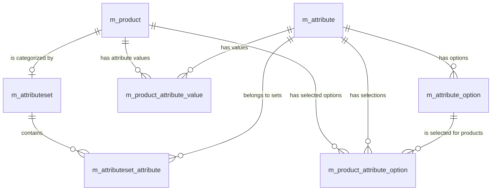

# System Patterns

## Architectural Overview

- **Tiering:** SvelteKit UI backed by Supabase services; all database access is encapsulated in service classes implementing `CRUDService`.
- **Presentation:** Component-driven UI using Shadcn-Svelte primitives and Tailwind CSS utility classes.
- **Forms:** `sveltekit-superforms` orchestrates validation + submission; schemas sourced from Zod definitions (`@tihomir971/assist-shared`).
- **Storage Abstraction:** Cart functionality showcases a storage-agnostic pattern using the `ICartStorage<T>` interface to support local or Supabase persistence with consistent reactivity.

```ts
interface ICartStorage<T> {
	get(): Promise<T[]>;
	set(items: T[]): Promise<void>;
	update(id: number, updates: Partial<T>): Promise<void>;
	delete(id: number): Promise<void>;
	subscribe(callback: (items: T[]) => void): () => void;
}
```

## Key Technical Decisions

| Topic              | Decision                                                                                  |
| ------------------ | ----------------------------------------------------------------------------------------- |
| Auth               | Supabase Auth sessions propagated via SvelteKit `handle` hook                             |
| CRUD UI            | Smart CRUD stack (`SmartPayloadBuilder` + `createSimpleCRUD` + `SmartForm`)               |
| List pages         | `createListPageLoader` + `DataTableConfigBuilder` for automatic filtering & invalidation  |
| Styling            | Tailwind CSS + Prettier Tailwind plugin; consistent theming via Shadcn components         |
| Validation         | Zod schemas shared between server actions and forms                                       |
| HTTP client        | `ky` to simplify fetch logic with middlewares                                             |
| Build tooling      | pnpm scripts, Vite plugins (Tailwind, Icons, devtools-json)                               |

## SvelteKit Best Practices Adopted

### Authentication & Authorization
- Prefer session-based auth (Lucia-style) for immediate revocation; tokens only when stateless APIs required.
- Session validation in `handle` with hydrated `locals` for downstream load/actions.

### Performance
- Rely on SvelteKit defaults: code-splitting, asset hashing, conservative invalidation.
- Use link preloading, streamed load functions, and parallel data fetching via `Promise.all`.
- Track bundle health with `knip` and dynamic imports for conditional modules.

### Asset & Image Handling
- `@sveltejs/enhanced-img` recommended for responsive, optimized images (AVIF/WebP, intrinsic sizing).
- CDN-friendly approach via libraries like `@unpic/svelte` when assets are remote.
- Icon sets curated (avoid thousands of Svelte files); prefer CSS-based glyphs when possible.

### Accessibility
- Ensure unique `<title>` per route; rely on SvelteKit’s live-region announcements.
- Trust default focus management but override with `afterNavigate` hook when necessary.
- Always define language attributes and descriptive `alt` text.

### SEO
- SSR-first pages with consistent metadata via `<svelte:head>`.
- Dynamic sitemaps for canonical URLs; allow SvelteKit trailing-slash normalization.

## Advanced Routing & Layouts

- Route groups `(app)` to isolate domain layouts without URL pollution.
- Rest params `[...slug]`, optional `[[lang]]`, and matchers such as `[id=integer]`.
- Layout breakout using `+page@(group).svelte` to reuse shared shells selectively.

## Error Handling

- Structured Supabase errors via `extractStructuredSupabaseError` powering toast deduplication.
- Expected errors thrown with `error(status, data)`; unexpected ones caught by `handleError`.

## Workflow Automation

1. **Create** entity schemas in shared package → update Zod import.
2. **Service** implements `CRUDService` and `getLookup` method.
3. **Payload** builder strips control fields & enforces defaults.
4. **Server** module wires `createSimpleCRUD` / `createListPageLoader`.
5. **UI** uses `SmartForm`, `SmartRelatedTabs`, or `SmartTable` with proper `event.depends` keys.
6. **Invalidation** from drawers/tabs must match `depends` key for responsive refresh.

## Database Schema Highlight: Product Attributes

- Flexible attribute model supporting text, number, boolean, date, single- and multi-select values.
- Attribute sets (`m_attributeset`) map relevant attributes to product categories via `m_attributeset_attribute`.
- Selection values stored in `m_attribute_option` and linked to products through `m_product_attribute_option`.
- Non-selection values stored with type-specific columns in `m_product_attribute_value`.
- Sequence and requirement flags drive UI ordering and validation.

## Relationships (Mermaid)



## References

- [.roo/rules](../rules) for in-depth patterns (Smart CRUD, list pages, split layout, channel mapping).
- [.roo/docs/tech-context.md](./tech-context.md) for tooling and environment specifics.
- [.roo/docs/project-overview.md](./project-overview.md) for product goals.