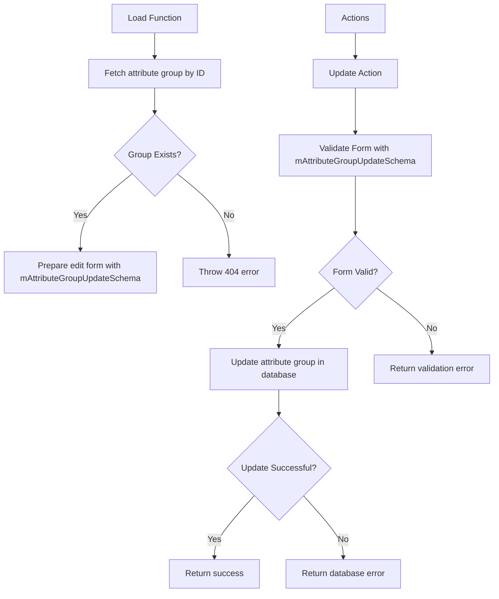
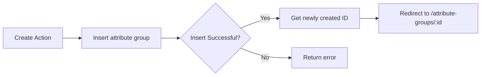

# Attribute Groups Edit Page Implementation Plan

## Current Understanding

From my analysis, I understand that:

1. There's an existing attribute groups page that lists all attribute groups
2. The [id] folder exists but doesn't contain any files yet
3. When a user successfully creates an attribute group, we want to redirect them to the edit page for that attribute group
4. We need to use the Supabase Zod schemas from `src/lib/types/supabase/supabase-zod-schemas.ts` for validation
5. The `updated_at` field is handled automatically by the database, so we don't need to set it manually

## Implementation Plan

### 1. Create the Edit Page Components

**File Structure:**
```
src/routes/(app)/catalog/product-attributes/attribute-groups/[id]/
├── +page.server.ts  - Server logic for edit page
└── +page.svelte     - UI for edit page
```

### 2. Server-side Logic (`+page.server.ts`)

The server-side logic needs to:

1. Load the attribute group by ID
2. Handle form validation using superValidate and the mAttributeGroupUpdateSchema
3. Process form submission to update the attribute group
4. Support toggling the active status



#### Implementation Details for `+page.server.ts`

```typescript
import { error, fail } from '@sveltejs/kit';
import { superValidate } from 'sveltekit-superforms/server';
import { mAttributeGroupUpdateSchema } from '$lib/types/supabase/supabase-zod-schemas';
import { zod } from 'sveltekit-superforms/adapters';

export const load = async ({ params, locals }: { params: { id: string }; locals: App.Locals }) => {
    const id = parseInt(params.id);
    
    if (isNaN(id)) {
        throw error(400, 'Invalid attribute group ID');
    }
    
    // Fetch the attribute group
    const { data: attributeGroup, error: fetchError } = await locals.supabase
        .from('m_attribute_group')
        .select('*')
        .eq('id', id)
        .single();
    
    if (fetchError || !attributeGroup) {
        throw error(404, 'Attribute group not found');
    }
    
    // Initialize the form with existing data using the Supabase Zod schema
    const form = await superValidate(attributeGroup, zod(mAttributeGroupUpdateSchema));
    
    return {
        attributeGroup,
        form
    };
};

export const actions = {
    update: async ({ request, locals, params }: { request: Request; locals: App.Locals; params: { id: string } }) => {
        const id = parseInt(params.id);
        
        if (isNaN(id)) {
            throw error(400, 'Invalid attribute group ID');
        }
        
        // Validate form using Supabase Zod schema
        const form = await superValidate(request, zod(mAttributeGroupUpdateSchema));
        
        if (!form.valid) {
            return fail(400, { form });
        }
        
        const { name, is_active } = form.data;
        
        const { error: updateError } = await locals.supabase
            .from('m_attribute_group')
            .update({
                name,
                is_active
                // updated_at is handled automatically by the database
            })
            .eq('id', id);
        
        if (updateError) {
            console.error('Error updating attribute group:', updateError);
            return fail(500, {
                form,
                error: 'Failed to update attribute group'
            });
        }
        
        return { form, success: true };
    }
};
```

### 3. Client-side UI (`+page.svelte`)

The edit page should include:

1. A form for editing the attribute group name
2. Option to toggle active/inactive status
3. Save button
4. Cancel button to return to the listing page
5. Proper error handling

```mermaid
componentDiagram
    component Header {
        Title["Edit Attribute Group"]
        Breadcrumbs["Navigation breadcrumbs"]
    }
    
    component EditForm {
        NameField["Name input field"]
        StatusToggle["Active/Inactive toggle"]
        ValidationErrors["Error messages"]
    }
    
    component Actions {
        SaveButton["Save Button"]
        CancelButton["Cancel Button"]
    }
    
    Header --> EditForm
    EditForm --> Actions
```

#### Implementation Details for `+page.svelte`

```svelte
<script lang="ts">
    import { page } from '$app/state';
    import { Button } from '$lib/components/ui/button';
    import * as Card from '$lib/components/ui/card/index.js';
    import { Input } from '$lib/components/ui/input';
    import { Label } from '$lib/components/ui/label';
    import * as Switch from '$lib/components/ui/switch/index.js';
    import { superForm } from 'sveltekit-superforms/client';
    
    let { data } = $props();
    
    // Edit form
    const { form, enhance, errors, message } = superForm(data.form, {
        onUpdated: ({ form }) => {
            if (form.valid) {
                // Display success message or toast
            }
        }
    });
</script>

<div class="container mx-auto py-6">
    <div class="mb-6 flex items-center justify-between">
        <div>
            <h1 class="text-3xl font-bold">Edit Attribute Group</h1>
            <p class="text-muted-foreground">Update attribute group details</p>
        </div>
        <Button variant="outline" href="/catalog/product-attributes/attribute-groups">
            Back to List
        </Button>
    </div>
    
    <Card.Root>
        <Card.Header>
            <Card.Title>Attribute Group Details</Card.Title>
            <Card.Description>Update the name and status of this attribute group</Card.Description>
        </Card.Header>
        <Card.Content>
            <form method="POST" action="?/update" use:enhance>
                <input type="hidden" name="id" value={$form.id} />
                
                <div class="grid gap-6">
                    <div class="grid gap-2">
                        <Label for="name">Name</Label>
                        <Input id="name" name="name" bind:value={$form.name} required />
                        {#if $errors.name}
                            <p class="text-sm text-red-500">{$errors.name}</p>
                        {/if}
                    </div>
                    
                    <div class="flex items-center gap-2">
                        <Switch.Root name="is_active" checked={$form.is_active} onCheckedChange={(checked) => $form.is_active = checked}>
                            <Switch.Thumb />
                        </Switch.Root>
                        <Label for="is_active">Active</Label>
                    </div>
                    
                    <div class="flex justify-end gap-2">
                        <Button type="submit">Save Changes</Button>
                    </div>
                </div>
            </form>
        </Card.Content>
    </Card.Root>
</div>
```

### 4. Update Creation Logic for Redirection

Modify the existing `+page.server.ts` create action to:

1. Return the ID of the newly created attribute group
2. Implement redirection to the edit page using that ID



#### Changes to existing `+page.server.ts` create action

```typescript
import { redirect } from '@sveltejs/kit';

export const actions = {
    create: async ({ request, locals }: { request: Request; locals: App.Locals }) => {
        const form = await superValidate(request, zod(createAttributeGroupSchema));
        
        if (!form.valid) {
            return fail(400, { form });
        }
        
        const { name } = form.data;
        
        // Update to return the ID and use redirect
        const { data: newGroup, error: insertError } = await locals.supabase
            .from('m_attribute_group')
            .insert({
                name,
                is_active: true // Default to active
                // created_at and updated_at are handled automatically by the database
            })
            .select('id')  // Return the ID of the newly created record
            .single();
        
        if (insertError) {
            console.error('Error creating attribute group:', insertError);
            return fail(500, {
                form,
                error: 'Failed to create attribute group'
            });
        }
        
        // Redirect to the edit page
        throw redirect(303, `/catalog/product-attributes/attribute-groups/${newGroup.id}`);
    },
    
    // ... rest of the actions remain the same
};
```

### 5. Implementation Steps

1. Create the [id]/+page.server.ts file:
   - Import necessary dependencies, including mAttributeGroupUpdateSchema from Supabase Zod schemas
   - Implement load function to fetch and validate attribute group
   - Implement update action

2. Create the [id]/+page.svelte file:
   - Create the form UI with name input and active toggle
   - Implement form submission with superForm

3. Update the existing +page.server.ts file:
   - Modify the create action to select and return the ID
   - Add redirect to the edit page after successful creation

## Testing Strategy

1. Test loading an existing attribute group
2. Test loading a non-existent attribute group (should 404)
3. Test form validation (required fields, etc.)
4. Test successful update of name and active status
5. Test redirection after creation to ensure it takes you to the edit page

## Recommended Next Steps

1. Implement the [id]/+page.server.ts file using the mAttributeGroupUpdateSchema
2. Implement the [id]/+page.svelte file for the edit UI
3. Update the existing create action to redirect to the edit page
4. Test the full workflow from creation to editing