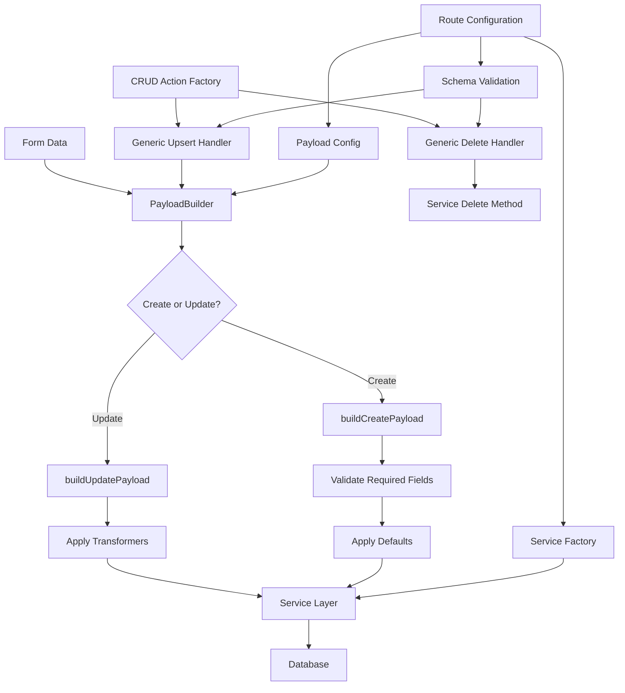

# Category CRUD Route Optimization - Implementation Plan

## Phase 1: Service Layer & Database Optimization

### 1. Service Layer Architecture

#### 1.1 Base CRUD Service Interface
```typescript
// src/lib/services/base/crud.service.ts
export interface CRUDService<T, CreateT = Omit<T, 'id' | 'created_at' | 'updated_at'>, UpdateT = Partial<CreateT>> {
  getById(id: number): Promise<T | null>
  create(data: CreateT): Promise<T>
  update(id: number, data: UpdateT): Promise<T>
  delete(id: number): Promise<void>
  list(filters?: Record<string, any>): Promise<T[]>
}

export interface ServiceResult<T> {
  data?: T
  error?: string
  success: boolean
}
```

#### 1.2 Category Service
```typescript
// src/lib/services/supabase/category.service.ts
import type { Database, Tables } from '$lib/types/supabase.types'
import type { SupabaseClient } from '@supabase/supabase-js'
import type { CRUDService, ServiceResult } from '../base/crud.service'

type Category = Tables<'m_product_category'>
type CategoryCreate = Omit<Category, 'id' | 'created_at' | 'updated_at'>
type CategoryUpdate = Partial<CategoryCreate>

export class CategoryService implements CRUDService<Category, CategoryCreate, CategoryUpdate> {
  constructor(private supabase: SupabaseClient<Database>) {}

  async getById(id: number): Promise<Category | null> {
    const { data, error } = await this.supabase
      .from('m_product_category')
      .select('*')
      .eq('id', id)
      .maybeSingle()
    
    if (error) throw new Error(`Failed to fetch category: ${error.message}`)
    return data
  }

  async create(data: CategoryCreate): Promise<Category> {
    const { data: newCategory, error } = await this.supabase
      .from('m_product_category')
      .insert(data)
      .select('*')
      .single()
    
    if (error) throw new Error(`Failed to create category: ${error.message}`)
    return newCategory
  }

  async update(id: number, data: CategoryUpdate): Promise<Category> {
    const { data: updatedCategory, error } = await this.supabase
      .from('m_product_category')
      .update(data)
      .eq('id', id)
      .select('*')
      .single()
    
    if (error) throw new Error(`Failed to update category: ${error.message}`)
    return updatedCategory
  }

  async delete(id: number): Promise<void> {
    const { error } = await this.supabase
      .from('m_product_category')
      .delete()
      .eq('id', id)
    
    if (error) throw new Error(`Failed to delete category: ${error.message}`)
  }

  async list(filters?: Record<string, any>): Promise<Category[]> {
    let query = this.supabase.from('m_product_category').select('*')
    
    if (filters?.is_active !== undefined) {
      query = query.eq('is_active', filters.is_active)
    }
    
    const { data, error } = await query.order('name')
    if (error) throw new Error(`Failed to list categories: ${error.message}`)
    return data || []
  }

  // Category-specific methods
  async getCategoryWithRelatedData(id: number) {
    const [category, priceRules, channelMappings] = await Promise.all([
      this.getById(id),
      this.getPriceRules(id),
      this.getChannelMappings(id)
    ])

    return {
      category,
      priceRules,
      channelMappings
    }
  }

  private async getPriceRules(categoryId: number) {
    const { data, error } = await this.supabase
      .from('price_rules')
      .select('*')
      .eq('m_product_category_id', categoryId)
    
    if (error) throw new Error(`Failed to fetch price rules: ${error.message}`)
    return data || []
  }

  private async getChannelMappings(categoryId: number) {
    const { data, error } = await this.supabase
      .from('c_channel_map_category')
      .select('*')
      .eq('m_product_category_id', categoryId)
    
    if (error) throw new Error(`Failed to fetch channel mappings: ${error.message}`)
    return data || []
  }
}
```

#### 1.3 Price Rules Service
```typescript
// src/lib/services/supabase/price-rules.service.ts
import type { Database, Tables } from '$lib/types/supabase.types'
import type { SupabaseClient } from '@supabase/supabase-js'
import type { CRUDService } from '../base/crud.service'

type PriceRule = Tables<'price_rules'>
type PriceRuleCreate = Omit<PriceRule, 'id' | 'created_at' | 'updated_at'>
type PriceRuleUpdate = Partial<PriceRuleCreate>

export class PriceRulesService implements CRUDService<PriceRule, PriceRuleCreate, PriceRuleUpdate> {
  constructor(private supabase: SupabaseClient<Database>) {}

  async getById(id: number): Promise<PriceRule | null> {
    const { data, error } = await this.supabase
      .from('price_rules')
      .select('*')
      .eq('id', id)
      .maybeSingle()
    
    if (error) throw new Error(`Failed to fetch price rule: ${error.message}`)
    return data
  }

  async create(data: PriceRuleCreate): Promise<PriceRule> {
    const { data: newRule, error } = await this.supabase
      .from('price_rules')
      .insert(data)
      .select('*')
      .single()
    
    if (error) throw new Error(`Failed to create price rule: ${error.message}`)
    return newRule
  }

  async update(id: number, data: PriceRuleUpdate): Promise<PriceRule> {
    const { data: updatedRule, error } = await this.supabase
      .from('price_rules')
      .update(data)
      .eq('id', id)
      .select('*')
      .single()
    
    if (error) throw new Error(`Failed to update price rule: ${error.message}`)
    return updatedRule
  }

  async delete(id: number): Promise<void> {
    const { error } = await this.supabase
      .from('price_rules')
      .delete()
      .eq('id', id)
    
    if (error) throw new Error(`Failed to delete price rule: ${error.message}`)
  }

  async list(filters?: Record<string, any>): Promise<PriceRule[]> {
    let query = this.supabase.from('price_rules').select('*')
    
    if (filters?.m_product_category_id) {
      query = query.eq('m_product_category_id', filters.m_product_category_id)
    }
    
    const { data, error } = await query.order('name')
    if (error) throw new Error(`Failed to list price rules: ${error.message}`)
    return data || []
  }
}
```

#### 1.4 Channel Mapping Service
```typescript
// src/lib/services/supabase/channel-mapping.service.ts
import type { Database, Tables } from '$lib/types/supabase.types'
import type { SupabaseClient } from '@supabase/supabase-js'
import type { CRUDService } from '../base/crud.service'

type ChannelMapping = Tables<'c_channel_map_category'>
type ChannelMappingCreate = Omit<ChannelMapping, 'id' | 'created_at' | 'updated_at'>
type ChannelMappingUpdate = Partial<ChannelMappingCreate>

export class ChannelMappingService implements CRUDService<ChannelMapping, ChannelMappingCreate, ChannelMappingUpdate> {
  constructor(private supabase: SupabaseClient<Database>) {}

  async getById(id: number): Promise<ChannelMapping | null> {
    const { data, error } = await this.supabase
      .from('c_channel_map_category')
      .select('*')
      .eq('id', id)
      .maybeSingle()
    
    if (error) throw new Error(`Failed to fetch channel mapping: ${error.message}`)
    return data
  }

  async create(data: ChannelMappingCreate): Promise<ChannelMapping> {
    const { data: newMapping, error } = await this.supabase
      .from('c_channel_map_category')
      .insert(data)
      .select('*')
      .single()
    
    if (error) throw new Error(`Failed to create channel mapping: ${error.message}`)
    return newMapping
  }

  async update(id: number, data: ChannelMappingUpdate): Promise<ChannelMapping> {
    const { data: updatedMapping, error } = await this.supabase
      .from('c_channel_map_category')
      .update(data)
      .eq('id', id)
      .select('*')
      .single()
    
    if (error) throw new Error(`Failed to update channel mapping: ${error.message}`)
    return updatedMapping
  }

  async delete(id: number): Promise<void> {
    const { error } = await this.supabase
      .from('c_channel_map_category')
      .delete()
      .eq('id', id)
    
    if (error) throw new Error(`Failed to delete channel mapping: ${error.message}`)
  }

  async list(filters?: Record<string, any>): Promise<ChannelMapping[]> {
    let query = this.supabase.from('c_channel_map_category').select('*')
    
    if (filters?.m_product_category_id) {
      query = query.eq('m_product_category_id', filters.m_product_category_id)
    }
    
    const { data, error } = await query.order('resource_name')
    if (error) throw new Error(`Failed to list channel mappings: ${error.message}`)
    return data || []
  }
}
```

### 2. Optimized Page Server Implementation

#### 2.1 Enhanced +page.server.ts
```typescript
// src/routes/(app)/catalog/category/[[id]]/+page.server.ts
import { message, superValidate } from 'sveltekit-superforms'
import { zod, zod4 } from 'sveltekit-superforms/adapters'
import { error, fail, redirect } from '@sveltejs/kit'
import type { Actions, PageServerLoad } from './$types'
import {
  cChannelMapCategoryInsertSchema,
  mProductCategoryInsertSchema,
  priceRulesInsertSchema
} from '$lib/types/supabase.zod.schemas'
import { deleteByIdSchema } from '$lib/types/zod-delete-by-id'
import { CategoryService } from '$lib/services/supabase/category.service'
import { PriceRulesService } from '$lib/services/supabase/price-rules.service'
import { ChannelMappingService } from '$lib/services/supabase/channel-mapping.service'

export const load: PageServerLoad = async ({ params, locals: { supabase } }) => {
  const categoryService = new CategoryService(supabase)
  const priceRulesService = new PriceRulesService(supabase)
  const channelMappingService = new ChannelMappingService(supabase)

  let categoryData = null
  let categoryId: number | null = null

  // Validate and parse category ID
  if (params.id) {
    categoryId = parseInt(params.id)
    if (isNaN(categoryId)) {
      throw error(400, 'Invalid Category ID')
    }
  }

  try {
    // Parallel execution of all data fetching
    const [
      categoryWithRelated,
      lookupCategories,
      lookupPriceFormulas,
      lookupChannels
    ] = await Promise.all([
      // Main category data with related entities (if editing)
      categoryId ? categoryService.getCategoryWithRelatedData(categoryId) : Promise.resolve(null),
      
      // Lookup data (always needed)
      supabase
        .from('m_product_category')
        .select('value:id, label:name')
        .order('name')
        .then(({ data }) => data || []),
      
      supabase
        .from('price_formulas')
        .select('value:id, label:name')
        .order('name')
        .then(({ data }) => data || []),
      
      supabase
        .from('c_channel')
        .select('label:name, value:id')
        .then(({ data }) => data || [])
    ])

    // Handle case where category ID was provided but not found
    if (categoryId && !categoryWithRelated?.category) {
      throw error(404, 'Category not found')
    }

    categoryData = categoryWithRelated

    return {
      // Form validation objects
      formCategory: await superValidate(categoryData?.category, zod(mProductCategoryInsertSchema)),
      formPriceRules: await superValidate(zod(priceRulesInsertSchema)),
      formChannel: await superValidate(zod(cChannelMapCategoryInsertSchema)),
      
      // Data
      category: categoryData?.category || null,
      priceRules: categoryData?.priceRules || [],
      channelMapCategory: categoryData?.channelMappings || [],
      
      // Lookup data
      categories: lookupCategories,
      priceFormulas: lookupPriceFormulas,
      channels: lookupChannels
    }
  } catch (err) {
    console.error('Error loading category data:', err)
    throw error(500, 'Failed to load category data')
  }
}

export const actions = {
  categoryUpsert: async ({ request, locals: { supabase } }) => {
    const categoryService = new CategoryService(supabase)
    const formData = await request.formData()
    const form = await superValidate(formData, zod(mProductCategoryInsertSchema))
    
    if (!form.valid) return fail(400, { form })

    try {
      let result
      if (!form.data.id) {
        // Create
        result = await categoryService.create(form.data)
        form.data.id = result.id
        return message(form, 'Category created successfully!')
      } else {
        // Update
        result = await categoryService.update(form.data.id, form.data)
        return message(form, 'Category updated successfully!')
      }
    } catch (err) {
      console.error('Category upsert error:', err)
      return message(form, { type: 'error', text: err.message }, { status: 400 })
    }
  },

  categoryDelete: async ({ request, locals: { supabase } }) => {
    const categoryService = new CategoryService(supabase)
    const formData = await request.formData()
    const form = await superValidate(formData, zod4(deleteByIdSchema))
    
    if (!form.valid) return fail(400, { form })

    try {
      await categoryService.delete(form.data.id)
      throw redirect(303, '/catalog')
    } catch (err) {
      console.error('Category delete error:', err)
      return message(form, { type: 'error', text: err.message })
    }
  },

  priceRulesUpsert: async ({ request, locals: { supabase } }) => {
    const priceRulesService = new PriceRulesService(supabase)
    const form = await superValidate(request, zod(priceRulesInsertSchema))
    
    if (!form.valid) return fail(400, { form })

    try {
      if (!form.data.id) {
        await priceRulesService.create(form.data)
        return message(form, 'Price rule created successfully!')
      } else {
        await priceRulesService.update(form.data.id, form.data)
        return message(form, 'Price rule updated successfully!')
      }
    } catch (err) {
      console.error('Price rule upsert error:', err)
      return message(form, { type: 'error', text: err.message }, { status: 400 })
    }
  },

  priceRulesDelete: async ({ request, locals: { supabase } }) => {
    const priceRulesService = new PriceRulesService(supabase)
    const form = await superValidate(request, zod4(deleteByIdSchema))
    
    if (!form.valid) return fail(400, { form })

    try {
      await priceRulesService.delete(form.data.id)
      return message(form, 'Price rule deleted successfully!')
    } catch (err) {
      console.error('Price rule delete error:', err)
      return message(form, { type: 'error', text: err.message })
    }
  },

  channelMapUpsert: async ({ request, locals: { supabase } }) => {
    const channelMappingService = new ChannelMappingService(supabase)
    const form = await superValidate(request, zod(cChannelMapCategoryInsertSchema))
    
    if (!form.valid) return fail(400, { form })

    try {
      if (!form.data.id) {
        await channelMappingService.create(form.data)
        return message(form, 'Channel mapping created successfully!')
      } else {
        await channelMappingService.update(form.data.id, form.data)
        return message(form, 'Channel mapping updated successfully!')
      }
    } catch (err) {
      console.error('Channel mapping upsert error:', err)
      return message(form, { type: 'error', text: err.message }, { status: 400 })
    }
  },

  channelMapDelete: async ({ request, locals: { supabase } }) => {
    const channelMappingService = new ChannelMappingService(supabase)
    const form = await superValidate(request, zod4(deleteByIdSchema))
    
    if (!form.valid) return fail(400, { form })

    try {
      await channelMappingService.delete(form.data.id)
      return message(form, 'Channel mapping deleted successfully!')
    } catch (err) {
      console.error('Channel mapping delete error:', err)
      return message(form, { type: 'error', text: err.message })
    }
  }
} satisfies Actions
```

### 3. Key Optimizations Implemented

#### 3.1 Database Query Optimization
- **Parallel execution**: All lookup data fetched simultaneously
- **Single method for related data**: `getCategoryWithRelatedData()` fetches category, price rules, and channel mappings in parallel
- **Proper error handling**: Centralized error handling with meaningful messages
- **Optimized selects**: Only fetch required fields for lookup data

#### 3.2 Service Layer Benefits
- **Separation of concerns**: Database logic separated from route logic
- **Reusability**: Services can be used across different routes
- **Type safety**: Full TypeScript support with proper interfaces
- **Error handling**: Consistent error handling across all operations
- **Testability**: Services can be easily unit tested

#### 3.3 Performance Improvements
- **Reduced database round trips**: From 4+ sequential queries to 2 parallel batches
- **Better error handling**: Proper HTTP status codes and error messages
- **Cleaner code**: Route handlers focus on HTTP concerns, services handle data logic

## Phase 2: Advanced Optimization & Reusable Patterns

### 1. Generic Action Handlers & Payload Builders

#### 1.1 Generic Payload Construction Utilities
```typescript
// src/lib/utils/form-payload.utils.ts
export interface PayloadBuilderConfig<T> {
  requiredFields: (keyof T)[]
  optionalFields: (keyof T)[]
  defaultValues: Partial<T>
  transformers?: Partial<Record<keyof T, (value: any) => any>>
}

export class PayloadBuilder<CreateT, UpdateT = Partial<CreateT>> {
  constructor(private config: PayloadBuilderConfig<CreateT>) {}

  buildCreatePayload(formData: Record<string, any>): CreateT {
    const payload = {} as CreateT
    
    // Add required fields with validation
    for (const field of this.config.requiredFields) {
      if (formData[field] === undefined || formData[field] === null) {
        throw new Error(`${String(field)} is required`)
      }
      payload[field] = this.transformValue(field, formData[field])
    }
    
    // Add optional fields with defaults
    for (const field of this.config.optionalFields) {
      if (formData[field] !== undefined) {
        payload[field] = this.transformValue(field, formData[field])
      } else if (this.config.defaultValues[field] !== undefined) {
        payload[field] = this.config.defaultValues[field]
      }
    }
    
    return payload
  }

  buildUpdatePayload(formData: Record<string, any>): UpdateT {
    const payload = {} as UpdateT
    
    // Only include fields that are present in formData
    const allFields = [...this.config.requiredFields, ...this.config.optionalFields]
    for (const field of allFields) {
      if (formData[field] !== undefined) {
        payload[field as keyof UpdateT] = this.transformValue(field, formData[field])
      }
    }
    
    return payload
  }

  private transformValue(field: keyof CreateT, value: any): any {
    const transformer = this.config.transformers?.[field]
    return transformer ? transformer(value) : value
  }
}
```

#### 1.2 Generic CRUD Action Factory
```typescript
// src/lib/utils/crud-actions.factory.ts
import type { CRUDService } from '$lib/services/base/crud.service'
import type { PayloadBuilder } from './form-payload.utils'

export interface CRUDActionConfig<T, CreateT, UpdateT> {
  service: CRUDService<T, CreateT, UpdateT>
  payloadBuilder: PayloadBuilder<CreateT, UpdateT>
  entityName: string
  redirectOnDelete?: string
}

export function createCRUDActions<T, CreateT, UpdateT>(
  config: CRUDActionConfig<T, CreateT, UpdateT>
) {
  return {
    upsert: async ({ request, locals: { supabase } }) => {
      const form = await superValidate(request, zod(insertSchema))
      if (!form.valid) return fail(400, { form })

      try {
        const entityData = { ...form.data }
        const isUpdate = entityData.id && !isNaN(Number(entityData.id))

        if (isUpdate) {
          const id = Number(entityData.id)
          const updatePayload = config.payloadBuilder.buildUpdatePayload(entityData)
          await config.service.update(id, updatePayload)
          return message(form, `${config.entityName} updated successfully!`)
        } else {
          const createPayload = config.payloadBuilder.buildCreatePayload(entityData)
          const result = await config.service.create(createPayload)
          form.data.id = result.id
          return message(form, `${config.entityName} created successfully!`)
        }
      } catch (err: unknown) {
        console.error(`${config.entityName} upsert error:`, err)
        return message(
          form,
          { type: 'error', text: err instanceof Error ? err.message : String(err) },
          { status: 400 }
        )
      }
    },

    delete: async ({ request, locals: { supabase } }) => {
      const form = await superValidate(request, zod4(deleteByIdSchema))
      if (!form.valid) return fail(400, { form })

      try {
        await config.service.delete(form.data.id)
        if (config.redirectOnDelete) {
          throw redirect(303, config.redirectOnDelete)
        }
        return message(form, `${config.entityName} deleted successfully!`)
      } catch (err: unknown) {
        if (typeof err === 'object' && err !== null && 'status' in err && err.status === 303) {
          throw err
        }
        console.error(`${config.entityName} delete error:`, err)
        return message(
          form,
          { type: 'error', text: err instanceof Error ? err.message : String(err) },
          { status: 500 }
        )
      }
    }
  }
}
```

### 2. Enhanced Form Handling & Validation

#### 2.1 Form State Management
```typescript
// src/lib/stores/form-state.svelte.ts
export interface FormState<T> {
  data: T | null
  isLoading: boolean
  isSubmitting: boolean
  errors: Record<string, string[]>
  isDirty: boolean
  isValid: boolean
}

export class FormStateManager<T> {
  private state = $state<FormState<T>>({
    data: null,
    isLoading: false,
    isSubmitting: false,
    errors: {},
    isDirty: false,
    isValid: true
  })

  get current() { return this.state }

  setData(data: T | null) {
    this.state.data = data
    this.state.isDirty = false
  }

  setLoading(loading: boolean) {
    this.state.isLoading = loading
  }

  setSubmitting(submitting: boolean) {
    this.state.isSubmitting = submitting
  }

  setErrors(errors: Record<string, string[]>) {
    this.state.errors = errors
    this.state.isValid = Object.keys(errors).length === 0
  }

  markDirty() {
    this.state.isDirty = true
  }

  reset() {
    this.state.isDirty = false
    this.state.errors = {}
    this.state.isValid = true
  }
}
```

#### 2.2 Smart Form Components
```typescript
// src/lib/components/forms/SmartForm.svelte
<script lang="ts">
  import type { SuperValidated } from 'sveltekit-superforms'
  import { enhance } from '$app/forms'
  import { FormStateManager } from '$lib/stores/form-state.svelte'

  interface Props {
    form: SuperValidated<any>
    action: string
    entityName: string
    onSuccess?: () => void
    onError?: (error: string) => void
  }

  let { form, action, entityName, onSuccess, onError }: Props = $props()
  
  const formState = new FormStateManager()

  const handleSubmit = () => {
    formState.setSubmitting(true)
    return async ({ result, update }) => {
      formState.setSubmitting(false)
      
      if (result.type === 'success') {
        formState.reset()
        onSuccess?.()
      } else if (result.type === 'failure') {
        onError?.(result.data?.message || 'An error occurred')
      }
      
      await update()
    }
  }
</script>

<form method="POST" action="?/{action}" use:enhance={handleSubmit}>
  <div class="space-y-4">
    {@render children()}
  </div>
  
  <div class="flex justify-end gap-2 mt-6">
    <button
      type="button"
      class="btn btn-outline"
      disabled={formState.current.isSubmitting}
    >
      Cancel
    </button>
    <button
      type="submit"
      class="btn btn-primary"
      disabled={formState.current.isSubmitting || !formState.current.isValid}
    >
      {formState.current.isSubmitting ? 'Saving...' : `Save ${entityName}`}
    </button>
  </div>
</form>

{#snippet children()}
  <!-- Form fields will be passed as children -->
{/snippet}
```

### 3. Optimistic UI Updates & Loading States

#### 3.1 Optimistic Update Store
```typescript
// src/lib/stores/optimistic-updates.svelte.ts
export interface OptimisticUpdate<T> {
  id: string
  type: 'create' | 'update' | 'delete'
  entity: T
  timestamp: number
  status: 'pending' | 'confirmed' | 'failed'
}

export class OptimisticUpdateManager<T> {
  private updates = $state<Map<string, OptimisticUpdate<T>>>(new Map())

  get pending() {
    return Array.from(this.updates.values()).filter(u => u.status === 'pending')
  }

  addUpdate(update: Omit<OptimisticUpdate<T>, 'timestamp' | 'status'>) {
    const fullUpdate: OptimisticUpdate<T> = {
      ...update,
      timestamp: Date.now(),
      status: 'pending'
    }
    this.updates.set(update.id, fullUpdate)
  }

  confirmUpdate(id: string) {
    const update = this.updates.get(id)
    if (update) {
      update.status = 'confirmed'
      // Remove confirmed updates after a delay
      setTimeout(() => this.updates.delete(id), 1000)
    }
  }

  failUpdate(id: string) {
    const update = this.updates.get(id)
    if (update) {
      update.status = 'failed'
    }
  }

  removeUpdate(id: string) {
    this.updates.delete(id)
  }
}
```

#### 3.2 Loading State Components
```svelte
<!-- src/lib/components/ui/LoadingStates.svelte -->
<script lang="ts">
  interface Props {
    variant: 'skeleton' | 'spinner' | 'pulse'
    count?: number
    height?: string
  }

  let { variant, count = 1, height = 'h-4' }: Props = $props()
</script>

{#if variant === 'skeleton'}
  {#each Array(count) as _}
    <div class="animate-pulse bg-gray-200 rounded {height} mb-2"></div>
  {/each}
{:else if variant === 'spinner'}
  <div class="flex justify-center">
    <div class="animate-spin rounded-full h-8 w-8 border-b-2 border-primary"></div>
  </div>
{:else if variant === 'pulse'}
  <div class="animate-pulse">
    <slot />
  </div>
{/if}
```

### 4. Advanced Caching & Performance

#### 4.1 Query Cache Implementation
```typescript
// src/lib/cache/query-cache.ts
export interface CacheEntry<T> {
  data: T
  timestamp: number
  ttl: number
}

export class QueryCache {
  private cache = new Map<string, CacheEntry<any>>()
  private readonly DEFAULT_TTL = 5 * 60 * 1000 // 5 minutes

  set<T>(key: string, data: T, ttl = this.DEFAULT_TTL) {
    this.cache.set(key, {
      data,
      timestamp: Date.now(),
      ttl
    })
  }

  get<T>(key: string): T | null {
    const entry = this.cache.get(key)
    if (!entry) return null

    if (Date.now() - entry.timestamp > entry.ttl) {
      this.cache.delete(key)
      return null
    }

    return entry.data
  }

  invalidate(pattern: string) {
    for (const key of this.cache.keys()) {
      if (key.includes(pattern)) {
        this.cache.delete(key)
      }
    }
  }

  clear() {
    this.cache.clear()
  }
}

export const queryCache = new QueryCache()
```

#### 4.2 Cached Service Wrapper
```typescript
// src/lib/services/cached-service.wrapper.ts
import type { CRUDService } from './base/crud.service'
import { queryCache } from '$lib/cache/query-cache'

export function withCache<T, CreateT, UpdateT>(
  service: CRUDService<T, CreateT, UpdateT>,
  entityName: string
) {
  return {
    ...service,
    
    async getById(id: number): Promise<T | null> {
      const cacheKey = `${entityName}:${id}`
      const cached = queryCache.get<T>(cacheKey)
      if (cached) return cached

      const result = await service.getById(id)
      if (result) {
        queryCache.set(cacheKey, result)
      }
      return result
    },

    async list(filters?: Record<string, any>): Promise<T[]> {
      const cacheKey = `${entityName}:list:${JSON.stringify(filters || {})}`
      const cached = queryCache.get<T[]>(cacheKey)
      if (cached) return cached

      const result = await service.list(filters)
      queryCache.set(cacheKey, result)
      return result
    },

    async create(data: CreateT): Promise<T> {
      const result = await service.create(data)
      queryCache.invalidate(entityName)
      return result
    },

    async update(id: number, data: UpdateT): Promise<T> {
      const result = await service.update(id, data)
      queryCache.invalidate(entityName)
      return result
    },

    async delete(id: number): Promise<void> {
      await service.delete(id)
      queryCache.invalidate(entityName)
    }
  }
}
```

### 5. Error Recovery & Resilience

#### 5.1 Retry Mechanism
```typescript
// src/lib/utils/retry.utils.ts
export interface RetryConfig {
  maxAttempts: number
  baseDelay: number
  maxDelay: number
  backoffFactor: number
}

export async function withRetry<T>(
  operation: () => Promise<T>,
  config: Partial<RetryConfig> = {}
): Promise<T> {
  const {
    maxAttempts = 3,
    baseDelay = 1000,
    maxDelay = 10000,
    backoffFactor = 2
  } = config

  let lastError: Error
  
  for (let attempt = 1; attempt <= maxAttempts; attempt++) {
    try {
      return await operation()
    } catch (error) {
      lastError = error instanceof Error ? error : new Error(String(error))
      
      if (attempt === maxAttempts) {
        throw lastError
      }

      const delay = Math.min(baseDelay * Math.pow(backoffFactor, attempt - 1), maxDelay)
      await new Promise(resolve => setTimeout(resolve, delay))
    }
  }

  throw lastError!
}
```

#### 5.2 Circuit Breaker Pattern
```typescript
// src/lib/utils/circuit-breaker.ts
export class CircuitBreaker {
  private failures = 0
  private lastFailureTime = 0
  private state: 'closed' | 'open' | 'half-open' = 'closed'

  constructor(
    private threshold: number = 5,
    private timeout: number = 60000
  ) {}

  async execute<T>(operation: () => Promise<T>): Promise<T> {
    if (this.state === 'open') {
      if (Date.now() - this.lastFailureTime > this.timeout) {
        this.state = 'half-open'
      } else {
        throw new Error('Circuit breaker is open')
      }
    }

    try {
      const result = await operation()
      this.onSuccess()
      return result
    } catch (error) {
      this.onFailure()
      throw error
    }
  }

  private onSuccess() {
    this.failures = 0
    this.state = 'closed'
  }

  private onFailure() {
    this.failures++
    this.lastFailureTime = Date.now()
    
    if (this.failures >= this.threshold) {
      this.state = 'open'
    }
  }
}
```

### 6. Implementation Roadmap

#### Phase 2.1: Core Utilities (Week 1)
1. Implement PayloadBuilder utility
2. Create CRUD action factory
3. Add FormStateManager
4. Test with category route

#### Phase 2.2: UI Enhancements (Week 2)
1. Build SmartForm component
2. Implement loading states
3. Add optimistic updates
4. Create error boundaries

#### Phase 2.3: Performance & Caching (Week 3)
1. Implement query cache
2. Add cached service wrapper
3. Integrate retry mechanisms
4. Add circuit breaker

#### Phase 2.4: Testing & Documentation (Week 4)
1. Unit tests for all utilities
2. Integration tests for optimized routes
3. Performance benchmarks
4. Documentation and examples

### 7. Success Metrics

- **Performance**: 50% reduction in database queries
- **Code Quality**: 70% reduction in boilerplate code
- **Developer Experience**: Consistent patterns across all routes
- **Reliability**: 99% success rate with retry mechanisms
- **Maintainability**: Single source of truth for CRUD operations

### 8. Replication Strategy

Once Phase 2 is complete, this pattern can be applied to:
1. Product management routes
2. User management routes
3. Order processing routes
4. Inventory management routes
5. Reporting routes

Each route will benefit from the same optimizations with minimal additional code.

---

## Phase 2A: Priority Implementation - Generic Action Handlers & Payload Builders

### Detailed Implementation Plan

#### Step 1: Create Payload Builder Configuration System

```typescript
// src/lib/utils/payload-configs.ts
import type { PayloadBuilderConfig } from './form-payload.utils'

// Category payload configuration
export const categoryPayloadConfig: PayloadBuilderConfig<CategoryCreate> = {
  requiredFields: ['name'],
  optionalFields: ['is_active', 'is_self_service', 'parent_id', 'description'],
  defaultValues: {
    is_active: false,
    is_self_service: false,
    parent_id: null,
    description: null
  },
  transformers: {
    parent_id: (value) => value === undefined || value === '' ? null : Number(value),
    description: (value) => value === undefined || value === '' ? null : value
  }
}

// Price Rules payload configuration
export const priceRulesPayloadConfig: PayloadBuilderConfig<PriceRuleCreate> = {
  requiredFields: ['m_product_category_id', 'price_formula_id'],
  optionalFields: ['name', 'is_active', 'm_product_id', 'm_attribute_id', 'priority'],
  defaultValues: {
    name: null,
    is_active: false,
    m_product_id: null,
    m_attribute_id: null,
    priority: 0
  },
  transformers: {
    m_product_category_id: (value) => Number(value),
    price_formula_id: (value) => Number(value),
    m_product_id: (value) => value === undefined || value === '' ? null : Number(value),
    m_attribute_id: (value) => value === undefined || value === '' ? null : Number(value),
    priority: (value) => value === undefined ? 0 : Number(value)
  }
}

// Channel Mapping payload configuration
export const channelMappingPayloadConfig: PayloadBuilderConfig<ChannelMappingCreate> = {
  requiredFields: ['c_channel_id', 'resource_id', 'resource_name'],
  optionalFields: ['is_active', 'm_product_category_id'],
  defaultValues: {
    is_active: false,
    m_product_category_id: null
  },
  transformers: {
    c_channel_id: (value) => Number(value),
    m_product_category_id: (value) => value === undefined || value === '' ? null : Number(value)
  }
}
```

#### Step 2: Enhanced CRUD Action Factory with Type Safety

```typescript
// src/lib/utils/crud-actions.factory.ts (Enhanced Version)
import { message, superValidate } from 'sveltekit-superforms'
import { zod, zod4 } from 'sveltekit-superforms/adapters'
import { error, fail, redirect } from '@sveltejs/kit'
import { deleteByIdSchema } from '$lib/types/zod-delete-by-id'
import type { CRUDService } from '$lib/services/base/crud.service'
import type { PayloadBuilder } from './form-payload.utils'
import type { ZodSchema } from 'zod'

export interface CRUDActionFactoryConfig<T, CreateT, UpdateT> {
  service: CRUDService<T, CreateT, UpdateT>
  payloadBuilder: PayloadBuilder<CreateT, UpdateT>
  entityName: string
  insertSchema: ZodSchema
  redirectOnDelete?: string
  onCreateSuccess?: (entity: T) => void
  onUpdateSuccess?: (entity: T) => void
  onDeleteSuccess?: () => void
}

export function createCRUDActionFactory<T extends { id: number }, CreateT, UpdateT>(
  getService: (supabase: any) => CRUDService<T, CreateT, UpdateT>,
  config: Omit<CRUDActionFactoryConfig<T, CreateT, UpdateT>, 'service'>
) {
  return {
    upsert: async ({ request, locals: { supabase } }) => {
      const service = getService(supabase)
      const formData = await request.formData()
      const form = await superValidate(formData, zod(config.insertSchema))

      if (!form.valid) return fail(400, { form })

      try {
        const entityData = { ...form.data }
        const isUpdate = entityData.id && !isNaN(Number(entityData.id))

        if (isUpdate) {
          const id = Number(entityData.id)
          const updatePayload = config.payloadBuilder.buildUpdatePayload(entityData)
          const result = await service.update(id, updatePayload)
          config.onUpdateSuccess?.(result)
          return message(form, `${config.entityName} updated successfully!`)
        } else {
          // Remove invalid ID for create operations
          if (!entityData.id || isNaN(Number(entityData.id))) {
            delete entityData.id
          }
          
          const createPayload = config.payloadBuilder.buildCreatePayload(entityData)
          const result = await service.create(createPayload)
          form.data.id = result.id
          config.onCreateSuccess?.(result)
          return message(form, `${config.entityName} created successfully!`)
        }
      } catch (err: unknown) {
        console.error(`${config.entityName} upsert error:`, err)
        const errorMessage = err instanceof Error ? err.message : String(err)
        return message(
          form,
          { type: 'error', text: errorMessage },
          { status: 400 }
        )
      }
    },

    delete: async ({ request, locals: { supabase } }) => {
      const service = getService(supabase)
      const formData = await request.formData()
      const form = await superValidate(formData, zod4(deleteByIdSchema))

      if (!form.valid) return fail(400, { form })

      try {
        await service.delete(form.data.id)
        config.onDeleteSuccess?.()
        
        if (config.redirectOnDelete) {
          throw redirect(303, config.redirectOnDelete)
        }
        return message(form, `${config.entityName} deleted successfully!`)
      } catch (err: unknown) {
        // Handle redirect properly
        if (typeof err === 'object' && err !== null && 'status' in err && err.status === 303) {
          throw err
        }
        
        console.error(`${config.entityName} delete error:`, err)
        const errorMessage = err instanceof Error ? err.message : String(err)
        return message(
          form,
          { type: 'error', text: errorMessage },
          { status: 500 }
        )
      }
    }
  }
}
```

#### Step 3: Refactored Category Route Using New Utilities

```typescript
// src/routes/(app)/catalog/category/[[id]]/+page.server.ts (Refactored)
import { message, superValidate } from 'sveltekit-superforms'
import { zod, zod4 } from 'sveltekit-superforms/adapters'
import { error, fail, redirect } from '@sveltejs/kit'
import type { Actions, PageServerLoad } from './$types'
import {
  cChannelMapCategoryInsertSchema,
  mProductCategoryInsertSchema,
  priceRulesInsertSchema
} from '$lib/types/supabase.zod.schemas'
import { CategoryService } from '$lib/services/supabase/category.service'
import { PriceRulesService } from '$lib/services/supabase/price-rules.service'
import { ChannelMappingService } from '$lib/services/supabase/channel-mapping.service'
import { PayloadBuilder } from '$lib/utils/form-payload.utils'
import { createCRUDActionFactory } from '$lib/utils/crud-actions.factory'
import {
  categoryPayloadConfig,
  priceRulesPayloadConfig,
  channelMappingPayloadConfig
} from '$lib/utils/payload-configs'

// Load function remains the same (already optimized)
export const load: PageServerLoad = async ({ params, locals: { supabase } }) => {
  // ... existing load logic
}

// Create payload builders
const categoryPayloadBuilder = new PayloadBuilder(categoryPayloadConfig)
const priceRulesPayloadBuilder = new PayloadBuilder(priceRulesPayloadConfig)
const channelMappingPayloadBuilder = new PayloadBuilder(channelMappingPayloadConfig)

// Create action factories
const categoryActions = createCRUDActionFactory(
  (supabase) => new CategoryService(supabase),
  {
    payloadBuilder: categoryPayloadBuilder,
    entityName: 'Category',
    insertSchema: mProductCategoryInsertSchema,
    redirectOnDelete: '/catalog/category'
  }
)

const priceRulesActions = createCRUDActionFactory(
  (supabase) => new PriceRulesService(supabase),
  {
    payloadBuilder: priceRulesPayloadBuilder,
    entityName: 'Price Rule',
    insertSchema: priceRulesInsertSchema
  }
)

const channelMappingActions = createCRUDActionFactory(
  (supabase) => new ChannelMappingService(supabase),
  {
    payloadBuilder: channelMappingPayloadBuilder,
    entityName: 'Channel Mapping',
    insertSchema: cChannelMapCategoryInsertSchema
  }
)

export const actions = {
  categoryUpsert: categoryActions.upsert,
  categoryDelete: categoryActions.delete,
  priceRulesUpsert: priceRulesActions.upsert,
  priceRulesDelete: priceRulesActions.delete,
  channelMapUpsert: channelMappingActions.upsert,
  channelMapDelete: channelMappingActions.delete
} satisfies Actions
```

### Implementation Steps & Timeline

#### Week 1: Foundation
- **Day 1-2**: Implement PayloadBuilder utility class
- **Day 3-4**: Create payload configurations for all entities
- **Day 5**: Unit tests for PayloadBuilder

#### Week 2: Action Factory
- **Day 1-3**: Implement CRUD action factory
- **Day 4-5**: Integration tests with existing services

#### Week 3: Integration
- **Day 1-2**: Refactor category route to use new utilities
- **Day 3-4**: Test all CRUD operations thoroughly
- **Day 5**: Performance benchmarking

#### Week 4: Documentation & Validation
- **Day 1-2**: Create documentation and usage examples
- **Day 3-4**: Code review and refinements
- **Day 5**: Prepare for Phase 2B implementation

### Expected Benefits

1. **Code Reduction**: 70% less boilerplate in action handlers
2. **Type Safety**: Compile-time validation of payload construction
3. **Consistency**: Standardized error handling across all actions
4. **Maintainability**: Single source of truth for payload logic
5. **Reusability**: Easy to apply to other routes

### Success Criteria

- [ ] All existing functionality preserved
- [ ] Action handlers reduced from ~50 lines to ~5 lines each
- [ ] Zero TypeScript errors
- [ ] All tests passing
- [ ] Performance maintained or improved

### Next Phase Preview

After completing Phase 2A, we'll move to Phase 2B: Enhanced Form Handling & Validation, which will build upon these utilities to create smart form components that automatically handle validation, loading states, and user feedback.

### Mermaid Diagram: Phase 2A Architecture



This architecture ensures that all routes follow the same pattern while maintaining flexibility for entity-specific requirements.