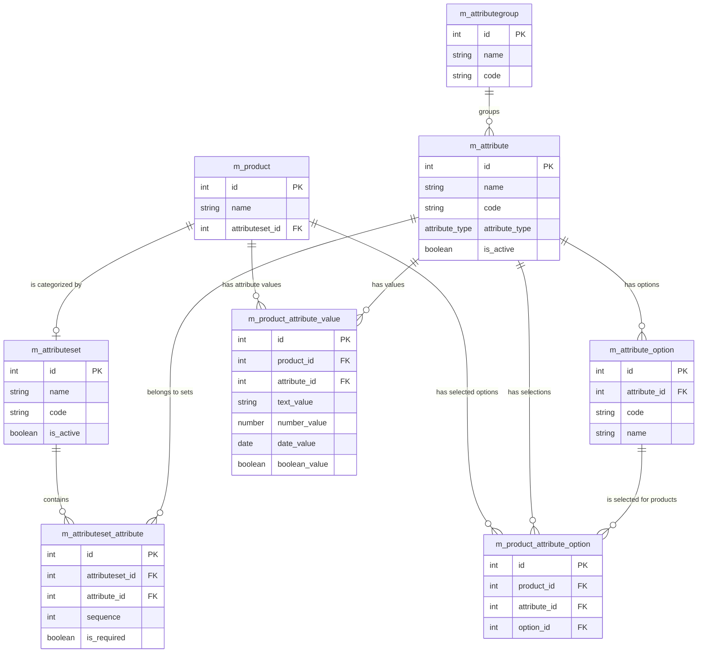

# System Patterns

**System Architecture:**

*   SvelteKit frontend with a Supabase backend.
*   Uses a component-based architecture with Shadcn-Svelte UI components.
*   Form handling is implemented using sveltekit-superforms.

**Key Technical Decisions:**

*   Using SvelteKit for its performance and developer experience.
*   Choosing Supabase for its ease of use and comprehensive feature set.
*   Adopting Shadcn-Svelte for a consistent and customizable UI.
*   Using sveltekit-superforms for type-safe form handling.
*   Using Zod for schema validation.
*   Using "ky" fetch library for API requests.

## SvelteKit Best Practices

### Authentication and Authorization

*   **Sessions vs Tokens**: 
    - Session IDs are stored in a database, can be immediately revoked, but require a database query on each request.
    - JWTs don't require database checks but cannot be immediately revoked.
*   **Integration Points**: Auth cookies can be checked in server hooks, with user information stored in `locals`.
*   **Recommended Solution**: Lucia is recommended for session-based web app authentication.

### Performance Optimization

*   **SvelteKit's Built-in Optimizations**:
    - Code-splitting for loading only necessary code
    - Asset preloading to prevent waterfalls
    - File hashing for effective caching
    - Request coalescing for grouping server load function data
    - Parallel loading for universal load functions
    - Data inlining for replaying server requests in the browser
    - Conservative invalidation for efficient load function re-runs
    - Prerendering for instant serving of static pages
    - Link preloading for anticipating navigation requirements

*   **Asset Optimization**:
    - **Images**: Use `@sveltejs/enhanced-img` for automatic optimization
    - **Videos**: Compress videos, lazy-load when below the fold, strip audio from muted videos
    - **Fonts**: Consider preloading critical fonts, use subsetting to reduce file size

*   **Code Size Reduction**:
    - Use the latest Svelte version
    - Analyze package size with tools like `rollup-plugin-visualizer`
    - Minimize third-party scripts
    - Use dynamic imports for conditional code

*   **Navigation Optimization**:
    - Use link preloading for faster client-side navigation
    - Stream non-essential data with promises in load functions
    - Prevent waterfalls by optimizing sequential requests

*   **Hosting Considerations**:
    - Co-locate frontend and backend in the same data center
    - Consider edge deployment for global performance
    - Ensure HTTP/2 or newer is used

### Image Handling

*   **Vite's Built-in Asset Handling**: Automatically processes imported assets for improved performance.

*   **@sveltejs/enhanced-img**: 
    - Provides automatic image optimization
    - Serves smaller file formats (avif, webp)
    - Sets intrinsic width and height to prevent layout shift
    - Creates multiple sizes for different devices
    - Strips EXIF data for privacy

*   **CDN Integration**: 
    - Use for images not available at build time
    - Consider libraries like `@unpic/svelte` for CDN-agnostic support

*   **Icon Handling**: 
    - Define icons in CSS when possible
    - Avoid libraries with thousands of .svelte files

*   **Best Practices**:
    - Use high-quality original images (2x display size for HiDPI)
    - Specify `sizes` for large images
    - Set `fetchpriority="high"` for important images
    - Always provide good `alt` text

### Accessibility

*   **Route Announcements**: 
    - SvelteKit injects a live region to announce page changes
    - Every page should have a unique, descriptive title

*   **Focus Management**: 
    - SvelteKit focuses the `<body>` after navigation
    - Elements with `autofocus` will be focused instead
    - Custom focus management possible with `afterNavigate` hook

*   **Language Attributes**: 
    - Set the correct `lang` attribute on the `<html>` element
    - For multi-language sites, update dynamically using the handle hook

### SEO Optimization

*   **Server-Side Rendering**: 
    - SvelteKit uses SSR by default for better indexing
    - Performance impacts search ranking

*   **Metadata**: 
    - Every page should have well-written `<title>` and `<meta name="description">` elements
    - Use `<svelte:head>` to set these elements

*   **Sitemaps**: 
    - Create dynamically using endpoints
    - Help search engines prioritize pages

*   **URL Normalization**: 
    - SvelteKit redirects URLs with/without trailing slashes to prevent duplicates

**Design Patterns in Use:**

*   Component-based architecture.
*   Form object pattern (sveltekit-superforms).
*   Utility-first CSS (Tailwind CSS).
*   Storage-agnostic pattern for cart implementation:
    ```typescript
    // Abstract storage interface allowing swapping between localStorage and Supabase
    interface ICartStorage<T> {
      get(): Promise<T[]>;
      set(items: T[]): Promise<void>;
      update(id: number, updates: Partial<T>): Promise<void>;
      delete(id: number): Promise<void>;
      subscribe(callback: (items: T[]) => void): () => void;
    }
    ```
    - Implementations:
      - LocalCartStorage: Uses LocalStorage class with Svelte's $state
      - SupabaseCartStorage: Uses Supabase client for persistence
    - Benefits:
      - Easy switching between storage implementations
      - Maintains reactivity
      - Type-safe operations
      - Async-first design

**Component Relationships:**

*   SvelteKit routes define the application's pages and API endpoints.
*   Shadcn-Svelte components are used to build the UI.
*   sveltekit-superforms handles form data and validation.
*   Supabase provides data storage and authentication.

## Database Schema

### Product Attributes System

We've designed a flexible product attributes system that supports multiple attribute types (single-select, multi-select, text, numeric, boolean, date) using attribute sets to organize attributes by product type.

#### Core Tables Structure

1. **m_attribute**: Defines attribute metadata
   - `id`: Primary key
   - `name`: Human-readable name
   - `code`: Unique identifier for programmatic reference
   - `attribute_type`: Enum ('single_select', 'multi_select', 'text', 'number', 'boolean', 'date')
   - `description`: Optional description
   - `is_active`: Boolean flag
   - `attribute_group_id`: Optional reference to attribute group
   - `created_at/updated_at`: Timestamps

2. **m_attribute_option**: Stores predefined values for selection attributes
   - `id`: Primary key
   - `attribute_id`: Reference to m_attribute
   - `code`: Unique identifier within the attribute
   - `name`: Display name
   - `sort_order`: For UI ordering
   - `is_active`: Boolean flag
   - `created_at/updated_at`: Timestamps

3. **m_attributeset**: Defines templates of attributes for different product types
   - `id`: Primary key
   - `name`: Display name
   - `code`: Unique identifier
   - `description`: Optional description
   - `is_active`: Boolean flag
   - `created_at/updated_at`: Timestamps

4. **m_attributeset_attribute**: Maps attributes to attribute sets
   - `id`: Primary key
   - `attributeset_id`: Reference to attribute set
   - `attribute_id`: Reference to attribute
   - `sequence`: For UI ordering
   - `is_required`: Whether this attribute is required for this set
   - `is_active`: Boolean flag
   - `created_at/updated_at`: Timestamps

5. **m_product_attribute_value**: Stores non-selection attribute values
   - `id`: Primary key
   - `product_id`: Reference to product
   - `attribute_id`: Reference to attribute
   - `text_value/number_value/date_value/boolean_value`: Type-specific values
   - `is_active`: Boolean flag
   - `created_at/updated_at`: Timestamps

6. **m_product_attribute_option**: Stores selected options for single/multi-select
   - `id`: Primary key
   - `product_id`: Reference to product
   - `attribute_id`: Reference to attribute
   - `option_id`: Reference to selected option
   - `is_active`: Boolean flag
   - `created_at/updated_at`: Timestamps

#### Key Features

1. **Attribute Types**: Supports different data types through the `attribute_type` enum
2. **Consistent Naming**: Uses `name`/`code` pattern across all reference tables
3. **Attribute Sets**: Groups attributes by product type for easier management
4. **Requirements Control**: Attribute requirements defined at the set level
5. **Performance Optimized**: Proper indexes and constraints
6. **Data Integrity**: Unique constraints prevent duplicates

#### Usage Patterns

- **Single Select**: Store a single row in m_product_attribute_option
- **Multi-Select**: Store multiple rows in m_product_attribute_option
- **Text/Number/Date/Boolean**: Store in appropriate column in m_product_attribute_value

#### Relationship Diagram


