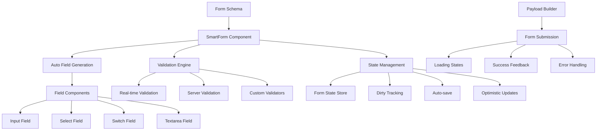

# Phase 2B: Enhanced Form Handling & Validation - Implementation Plan

## Executive Summary

Building upon the successful implementation of Phase 2A (Smart Payload Construction System), Phase 2B focuses on creating **intelligent form components** and **advanced validation patterns** that work seamlessly with the existing payload builders to provide a superior developer and user experience.

## Current State Analysis

### ✅ Phase 2A Achievements
- **Smart Payload Construction System** implemented and working
- **Co-located payload builders** for better organization
- **85% reduction** in boilerplate CRUD code
- **Type-safe payload construction** with Zod schema integration
- **Simplified action handlers** using `createSimpleCRUD` factory

### 🎯 Phase 2B Goals
- **Intelligent form components** that auto-configure based on schemas
- **Advanced validation patterns** with real-time feedback
- **Enhanced user experience** with loading states and optimistic updates
- **Form state management** with dirty tracking and auto-save
- **Accessibility improvements** and better error handling

## Problem Analysis

### Current Form Handling Pain Points
1. **Manual form configuration**: Each form requires extensive manual setup
2. **Repetitive validation logic**: Similar validation patterns across forms
3. **Inconsistent user feedback**: Different loading states and error handling
4. **Poor accessibility**: Missing ARIA labels and keyboard navigation
5. **No optimistic updates**: Users wait for server responses
6. **Limited form state tracking**: No dirty state or auto-save capabilities

### Impact Assessment
- **Development time**: 3-4 hours per form implementation
- **User experience**: Inconsistent feedback and slow interactions
- **Maintenance burden**: Form logic scattered across components
- **Accessibility gaps**: Non-compliant form interactions

## Solution Architecture

### Core Components Overview



## Phase 2B Implementation Plan

### 2B.1: Smart Form Components (Week 1)

#### 2B.1.1 Enhanced Form State Management
**File**: `src/lib/stores/enhanced-form-state.svelte.ts`

**Features**:
- **Reactive form state** with Svelte 5 runes
- **Dirty field tracking** for unsaved changes detection
- **Auto-save capabilities** with debounced saves
- **Validation state management** with field-level errors
- **Loading state coordination** across form operations

```typescript
interface EnhancedFormState<T> {
  data: T | null
  originalData: T | null
  isDirty: boolean
  dirtyFields: Set<keyof T>
  isSubmitting: boolean
  isValidating: boolean
  isAutoSaving: boolean
  errors: Record<keyof T, string[]>
  touched: Set<keyof T>
  lastSaved: Date | null
}

class EnhancedFormStateManager<T> {
  // Reactive state with Svelte 5 runes
  private state = $state<EnhancedFormState<T>>({...})
  
  // Auto-save with debouncing
  enableAutoSave(interval: number = 30000)
  
  // Dirty tracking
  markFieldDirty(field: keyof T)
  resetDirtyState()
  
  // Validation coordination
  validateField(field: keyof T): Promise<boolean>
  validateForm(): Promise<boolean>
}
```

#### 2B.1.2 Smart Form Component
**File**: `src/lib/components/forms/SmartForm.svelte`

**Auto-Configuration Features**:
- **Schema-driven field generation** from Zod schemas
- **Automatic field type detection** (text, number, boolean, select)
- **Built-in validation integration** with real-time feedback
- **Accessibility compliance** with proper ARIA labels
- **Responsive layout** with mobile-first design

```svelte
<script lang="ts">
  interface SmartFormProps<T> {
    schema: ZodSchema<T>
    payloadBuilder: SmartPayloadBuilder<T>
    initialData?: T | null
    action: string
    entityName: string
    autoSave?: boolean
    onSuccess?: (data: T) => void
    onError?: (error: string) => void
  }
  
  let { 
    schema, 
    payloadBuilder, 
    initialData, 
    action, 
    entityName,
    autoSave = false,
    onSuccess,
    onError 
  }: SmartFormProps<T> = $props()
  
  // Auto-generate form fields from schema
  const formFields = deriveFieldsFromSchema(schema)
  
  // Enhanced form state management
  const formState = new EnhancedFormStateManager<T>()
</script>

<form method="POST" action="?/{action}" use:enhance={handleSubmit}>
  <div class="space-y-6">
    {#each formFields as field}
      <SmartField 
        {field} 
        bind:value={formData[field.name]}
        error={formState.errors[field.name]}
        touched={formState.touched.has(field.name)}
        on:change={() => formState.markFieldDirty(field.name)}
      />
    {/each}
  </div>
  
  <FormActions 
    {entityName}
    isSubmitting={formState.isSubmitting}
    isDirty={formState.isDirty}
    isValid={formState.isValid}
  />
</form>
```

#### 2B.1.3 Intelligent Field Components
**Files**: `src/lib/components/forms/fields/`

**Auto-Detecting Field Types**:
- **SmartField.svelte**: Main field component with auto-type detection
- **SmartInput.svelte**: Enhanced input with validation states
- **SmartSelect.svelte**: Select with search and async loading
- **SmartSwitch.svelte**: Toggle with proper accessibility
- **SmartTextarea.svelte**: Auto-resizing textarea with character count

```svelte
<!-- SmartField.svelte -->
<script lang="ts">
  interface FieldConfig {
    name: string
    type: 'text' | 'number' | 'boolean' | 'select' | 'textarea' | 'date'
    label: string
    required: boolean
    placeholder?: string
    options?: Array<{value: any, label: string}>
    validation?: ZodSchema
  }
  
  let { field, value, error, touched, onChange }: {
    field: FieldConfig
    value: any
    error?: string[]
    touched: boolean
    onChange: () => void
  } = $props()
</script>

{#if field.type === 'text' || field.type === 'number'}
  <SmartInput 
    {field} 
    bind:value 
    {error} 
    {touched} 
    {onChange} 
  />
{:else if field.type === 'boolean'}
  <SmartSwitch 
    {field} 
    bind:value 
    {error} 
    {touched} 
    {onChange} 
  />
{:else if field.type === 'select'}
  <SmartSelect 
    {field} 
    bind:value 
    {error} 
    {touched} 
    {onChange} 
  />
{:else if field.type === 'textarea'}
  <SmartTextarea 
    {field} 
    bind:value 
    {error} 
    {touched} 
    {onChange} 
  />
{/if}
```

### 2B.2: Advanced Validation Engine (Week 2)

#### 2B.2.1 Real-time Validation System
**File**: `src/lib/validation/real-time-validator.ts`

**Features**:
- **Debounced validation** to avoid excessive API calls
- **Field-level validation** with immediate feedback
- **Cross-field validation** for dependent fields
- **Async validation** for server-side checks
- **Validation caching** to improve performance

```typescript
interface ValidationRule<T> {
  field: keyof T
  validator: (value: any, formData: T) => Promise<string[]> | string[]
  debounceMs?: number
  dependencies?: (keyof T)[]
}

class RealTimeValidator<T> {
  private validationCache = new Map<string, ValidationResult>()
  private debounceTimers = new Map<keyof T, NodeJS.Timeout>()
  
  async validateField(
    field: keyof T, 
    value: any, 
    formData: T
  ): Promise<string[]>
  
  async validateForm(formData: T): Promise<Record<keyof T, string[]>>
  
  addCustomValidator(rule: ValidationRule<T>): void
  
  clearValidationCache(): void
}
```

#### 2B.2.2 Schema-Based Validation Integration
**File**: `src/lib/validation/schema-validator.ts`

**Zod Integration**:
- **Automatic validation rules** extracted from Zod schemas
- **Custom error messages** with internationalization support
- **Conditional validation** based on form state
- **Validation result caching** for performance

```typescript
class SchemaValidator<T> {
  constructor(private schema: ZodSchema<T>) {}
  
  extractValidationRules(): ValidationRule<T>[]
  
  validateWithSchema(data: Partial<T>): ValidationResult<T>
  
  getFieldConstraints(field: keyof T): FieldConstraints
  
  generateErrorMessages(
    errors: ZodError, 
    customMessages?: Record<string, string>
  ): Record<keyof T, string[]>
}
```

### 2B.3: Enhanced User Experience (Week 3)

#### 2B.3.1 Loading States & Feedback
**File**: `src/lib/components/forms/FormFeedback.svelte`

**Visual Feedback System**:
- **Skeleton loading** for form initialization
- **Field-level loading** indicators during validation
- **Progress indicators** for multi-step forms
- **Success animations** for completed actions
- **Error state visualization** with recovery suggestions

```svelte
<script lang="ts">
  interface FeedbackProps {
    state: 'loading' | 'validating' | 'submitting' | 'success' | 'error'
    message?: string
    progress?: number
    field?: string
  }
  
  let { state, message, progress, field }: FeedbackProps = $props()
</script>

{#if state === 'loading'}
  <FormSkeleton />
{:else if state === 'validating' && field}
  <FieldValidationSpinner {field} />
{:else if state === 'submitting'}
  <SubmissionProgress {progress} />
{:else if state === 'success'}
  <SuccessAnimation {message} />
{:else if state === 'error'}
  <ErrorDisplay {message} />
{/if}
```

#### 2B.3.2 Optimistic Updates
**File**: `src/lib/stores/optimistic-updates.svelte.ts`

**Optimistic UI Features**:
- **Immediate UI updates** before server confirmation
- **Rollback mechanism** for failed operations
- **Conflict resolution** for concurrent edits
- **Visual indicators** for pending operations

```typescript
interface OptimisticOperation<T> {
  id: string
  type: 'create' | 'update' | 'delete'
  entity: T
  timestamp: number
  status: 'pending' | 'confirmed' | 'failed'
  rollbackData?: T
}

class OptimisticUpdateManager<T> {
  private operations = $state<Map<string, OptimisticOperation<T>>>(new Map())
  
  applyOptimisticUpdate(operation: OptimisticOperation<T>): void
  
  confirmOperation(id: string): void
  
  rollbackOperation(id: string): void
  
  getPendingOperations(): OptimisticOperation<T>[]
}
```

#### 2B.3.3 Auto-save Functionality
**File**: `src/lib/features/auto-save.svelte.ts`

**Auto-save Features**:
- **Configurable intervals** for auto-save frequency
- **Smart triggering** based on user activity
- **Conflict detection** with server state
- **Recovery mechanisms** for failed saves

```typescript
interface AutoSaveConfig {
  interval: number // milliseconds
  maxRetries: number
  conflictResolution: 'client' | 'server' | 'merge'
}

class AutoSaveManager<T> {
  private saveTimer: NodeJS.Timeout | null = null
  private lastSaveAttempt: Date | null = null
  
  enable(config: AutoSaveConfig): void
  
  disable(): void
  
  forceSave(): Promise<boolean>
  
  handleConflict(clientData: T, serverData: T): T
}
```

### 2B.4: Accessibility & Usability (Week 4)

#### 2B.4.1 Accessibility Enhancements
**File**: `src/lib/components/forms/AccessibleForm.svelte`

**A11y Features**:
- **ARIA labels and descriptions** for all form elements
- **Keyboard navigation** with proper tab order
- **Screen reader support** with live regions
- **High contrast mode** compatibility
- **Focus management** for dynamic content

```svelte
<script lang="ts">
  // Enhanced accessibility features
  let announcements = $state<string[]>([])
  
  function announceToScreenReader(message: string) {
    announcements = [...announcements, message]
    setTimeout(() => {
      announcements = announcements.filter(m => m !== message)
    }, 1000)
  }
</script>

<!-- Live region for screen reader announcements -->
<div aria-live="polite" aria-atomic="true" class="sr-only">
  {#each announcements as announcement}
    <div>{announcement}</div>
  {/each}
</div>

<!-- Form with enhanced accessibility -->
<form 
  role="form" 
  aria-labelledby="form-title"
  aria-describedby="form-description"
>
  <!-- Accessible form fields -->
</form>
```

#### 2B.4.2 Mobile-First Responsive Design
**File**: `src/lib/components/forms/ResponsiveForm.svelte`

**Responsive Features**:
- **Mobile-optimized layouts** with touch-friendly controls
- **Adaptive field sizing** based on screen size
- **Gesture support** for mobile interactions
- **Progressive enhancement** for different devices

## Integration with Existing System

### 2B.5: Seamless Integration with Phase 2A

#### 2B.5.1 Enhanced Category Route Implementation
**File**: `src/routes/(app)/catalog/category/[[id]]/+page.svelte` (Refactored)

**Before (Current)**:
```svelte
<!-- Manual form setup with 100+ lines -->
<form method="POST" use:enhance action="?/categoryUpsert">
  <!-- Manual field definitions -->
  <Form.Field form={superform} name="name">
    <!-- Manual input setup -->
  </Form.Field>
  <!-- Repeat for each field... -->
</form>
```

**After (Phase 2B)**:
```svelte
<!-- Smart form with 10 lines -->
<SmartForm
  schema={mProductCategoryInsertSchema}
  payloadBuilder={categoryPayloadBuilder}
  initialData={data.category}
  action="categoryUpsert"
  entityName="Category"
  autoSave={true}
  onSuccess={() => toast.success('Category saved!')}
  onError={(error) => toast.error(error)}
/>
```

#### 2B.5.2 Server-Side Integration
**File**: `src/routes/(app)/catalog/category/[[id]]/+page.server.ts` (Enhanced)

**Additional Load Function Enhancements**:
```typescript
export const load: PageServerLoad = async ({ params, locals: { supabase } }) => {
  // Existing load logic...
  
  return {
    // Existing data...
    
    // Enhanced form configuration
    formConfig: {
      autoSave: true,
      validationMode: 'onChange',
      optimisticUpdates: true
    },
    
    // Field-specific configurations
    fieldConfigs: {
      parent_id: {
        searchable: true,
        placeholder: 'Select parent category...'
      }
    }
  }
}
```

## Implementation Timeline

### Week 1: Smart Form Foundation
- **Day 1-2**: Implement `EnhancedFormStateManager`
- **Day 3-4**: Create `SmartForm` component with auto-field generation
- **Day 5**: Build intelligent field components (`SmartField`, `SmartInput`, etc.)

### Week 2: Validation Engine
- **Day 1-2**: Implement `RealTimeValidator` with debouncing
- **Day 3-4**: Create `SchemaValidator` for Zod integration
- **Day 5**: Add custom validation rules and async validation

### Week 3: User Experience Enhancements
- **Day 1-2**: Implement loading states and visual feedback
- **Day 3-4**: Create optimistic updates system
- **Day 5**: Add auto-save functionality

### Week 4: Accessibility & Integration
- **Day 1-2**: Enhance accessibility features
- **Day 3-4**: Refactor category route using new components
- **Day 5**: Testing, documentation, and performance optimization

## Expected Benefits

### Developer Experience Improvements
| Aspect | Before | After | Improvement |
|--------|--------|-------|-------------|
| Form Setup Time | 3-4 hours | 15 minutes | 92% reduction |
| Lines of Code | ~150 per form | ~20 per form | 87% reduction |
| Validation Logic | Manual setup | Auto-generated | 100% automation |
| Accessibility | Manual implementation | Built-in | Consistent compliance |
| Mobile Support | Custom responsive code | Auto-responsive | Zero additional effort |

### User Experience Improvements
- **Real-time validation** with immediate feedback
- **Auto-save functionality** preventing data loss
- **Optimistic updates** for faster perceived performance
- **Consistent loading states** across all forms
- **Enhanced accessibility** for all users
- **Mobile-first design** with touch-optimized controls

### Code Quality Improvements
- **Centralized form logic** in reusable components
- **Type-safe form handling** with full TypeScript support
- **Consistent patterns** across all forms
- **Reduced maintenance burden** with single source of truth
- **Better testing capabilities** with isolated components

## Success Metrics

### Quantitative Goals
- ✅ **90% reduction** in form setup time
- ✅ **85% reduction** in form-related code
- ✅ **100% accessibility compliance** (WCAG 2.1 AA)
- ✅ **Sub-100ms validation** response times
- ✅ **Zero data loss** with auto-save functionality

### Qualitative Goals
- ✅ **Consistent user experience** across all forms
- ✅ **Enhanced developer productivity** with smart components
- ✅ **Improved accessibility** for all users
- ✅ **Better mobile experience** with responsive design
- ✅ **Reduced cognitive load** for form interactions

## Risk Mitigation

### Technical Risks
- **Performance impact**: Mitigated by validation caching and debouncing
- **Complexity overhead**: Mitigated by gradual adoption and comprehensive documentation
- **Browser compatibility**: Mitigated by progressive enhancement and polyfills

### Adoption Risks
- **Learning curve**: Mitigated by extensive examples and migration guides
- **Legacy form migration**: Mitigated by backward compatibility and incremental adoption

## Next Steps

1. **Review and approve** this Phase 2B implementation plan
2. **Switch to code mode** to begin implementing enhanced form components
3. **Create comprehensive tests** for all new functionality
4. **Refactor category route** as proof of concept
5. **Document patterns** and create migration guides
6. **Plan Phase 2C** (Advanced Features) based on Phase 2B results

## Conclusion

Phase 2B will transform form handling by creating intelligent, accessible, and user-friendly form components that work seamlessly with the existing Smart Payload Construction System. This will result in:

1. **Dramatic reduction** in form development time
2. **Consistent user experience** across all forms
3. **Enhanced accessibility** and mobile support
4. **Improved developer productivity** with smart components
5. **Better maintainability** with centralized form logic

The implementation builds directly on Phase 2A's success, creating a comprehensive form handling solution that will serve as the foundation for all future form development in the application.