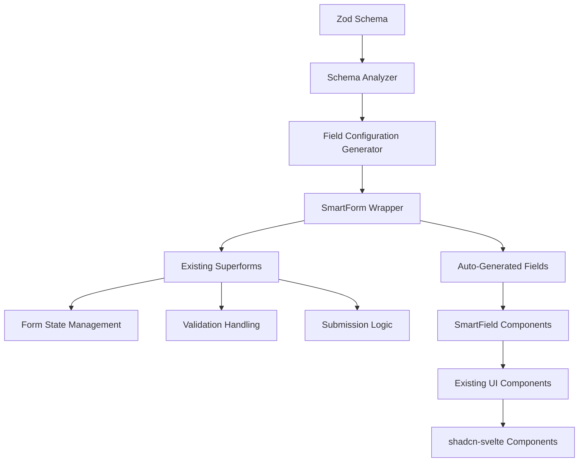

# Phase 2B.1: Smart Form Components - Week 1 Implementation Plan

## Overview

This week focuses on creating intelligent wrapper components that enhance the existing superforms infrastructure with auto-generation capabilities. We'll build on top of superforms rather than replacing it, ensuring compatibility with existing code while dramatically reducing form setup time.

## Architecture Strategy

### Superforms Enhancement Approach
- **Keep existing superforms** as the core form state management
- **Add smart wrappers** that auto-generate form fields from Zod schemas
- **Maintain backward compatibility** with existing form implementations
- **Provide gradual migration path** from manual to auto-generated forms



## Day-by-Day Implementation Plan

### Day 1: Schema Analysis & Field Detection

#### 1.1 Schema Analyzer Utility
**File**: `src/lib/utils/schema-analyzer.ts`

**Purpose**: Extract field information from Zod schemas to auto-generate form configurations.

```typescript
import { z, type ZodSchema, type ZodRawShape } from 'zod';

export interface FieldConfig {
  name: string;
  type: 'text' | 'number' | 'boolean' | 'select' | 'textarea' | 'date';
  label: string;
  required: boolean;
  placeholder?: string;
  description?: string;
  options?: Array<{ value: any; label: string }>;
  validation: {
    min?: number;
    max?: number;
    pattern?: string;
    custom?: string[];
  };
}

export interface FormConfig {
  fields: FieldConfig[];
  title: string;
  description?: string;
}

export class SchemaAnalyzer {
  static analyzeSchema<T>(schema: ZodSchema<T>): FormConfig {
    const shape = this.getSchemaShape(schema);
    const fields: FieldConfig[] = [];
    
    for (const [fieldName, fieldSchema] of Object.entries(shape)) {
      const fieldConfig = this.analyzeField(fieldName, fieldSchema as ZodSchema);
      if (fieldConfig) {
        fields.push(fieldConfig);
      }
    }
    
    return {
      fields,
      title: this.generateTitle(schema),
      description: this.extractDescription(schema)
    };
  }
  
  private static analyzeField(name: string, schema: ZodSchema): FieldConfig | null {
    const baseSchema = this.getBaseSchema(schema);
    const isOptional = this.isOptional(schema);
    const isNullable = this.isNullable(schema);
    
    // Skip system fields
    if (['id', 'created_at', 'updated_at'].includes(name)) {
      return null;
    }
    
    let type: FieldConfig['type'] = 'text';
    let validation: FieldConfig['validation'] = {};
    
    // Determine field type from Zod schema
    if (baseSchema instanceof z.ZodString) {
      type = name.includes('description') || name.includes('note') ? 'textarea' : 'text';
      validation.min = baseSchema.minLength ?? undefined;
      validation.max = baseSchema.maxLength ?? undefined;
    } else if (baseSchema instanceof z.ZodNumber) {
      type = 'number';
      validation.min = baseSchema.minValue ?? undefined;
      validation.max = baseSchema.maxValue ?? undefined;
    } else if (baseSchema instanceof z.ZodBoolean) {
      type = 'boolean';
    } else if (baseSchema instanceof z.ZodDate) {
      type = 'date';
    } else if (baseSchema instanceof z.ZodEnum) {
      type = 'select';
      // Extract enum options
    }
    
    return {
      name,
      type,
      label: this.generateLabel(name),
      required: !isOptional && !isNullable,
      placeholder: this.generatePlaceholder(name, type),
      validation
    };
  }
  
  private static generateLabel(fieldName: string): string {
    return fieldName
      .replace(/_/g, ' ')
      .replace(/([A-Z])/g, ' $1')
      .replace(/^./, str => str.toUpperCase())
      .trim();
  }
  
  private static generatePlaceholder(fieldName: string, type: FieldConfig['type']): string {
    const label = this.generateLabel(fieldName).toLowerCase();
    
    switch (type) {
      case 'text':
        return `Enter ${label}...`;
      case 'number':
        return `Enter ${label}...`;
      case 'textarea':
        return `Enter ${label}...`;
      case 'select':
        return `Select ${label}...`;
      default:
        return '';
    }
  }
  
  // Helper methods for schema introspection
  private static getSchemaShape(schema: ZodSchema): ZodRawShape {
    // Implementation similar to SmartPayloadBuilder
  }
  
  private static getBaseSchema(schema: ZodSchema): ZodSchema {
    // Implementation similar to SmartPayloadBuilder
  }
  
  private static isOptional(schema: ZodSchema): boolean {
    // Implementation similar to SmartPayloadBuilder
  }
  
  private static isNullable(schema: ZodSchema): boolean {
    // Check if schema allows null values
  }
}
```

#### 1.2 Field Configuration Types
**File**: `src/lib/types/form-config.types.ts`

```typescript
export interface LookupOption {
  value: any;
  label: string;
  description?: string;
  disabled?: boolean;
}

export interface FieldOverride {
  label?: string;
  placeholder?: string;
  description?: string;
  options?: LookupOption[];
  hidden?: boolean;
  readonly?: boolean;
  searchable?: boolean; // For select fields
}

export interface SmartFormConfig {
  title?: string;
  description?: string;
  fieldOverrides?: Record<string, FieldOverride>;
  layout?: 'single' | 'two-column' | 'three-column';
  showSystemFields?: boolean;
}
```

### Day 2: Smart Form Wrapper Component

#### 2.1 SmartForm Component
**File**: `src/lib/components/forms/SmartForm.svelte`

**Purpose**: Main wrapper component that enhances superforms with auto-generation.

```svelte
<script lang="ts">
  import type { SuperValidated } from 'sveltekit-superforms';
  import type { ZodSchema } from 'zod';
  import type { SmartPayloadBuilder } from '$lib/utils/smart-payload.builder';
  import type { SmartFormConfig } from '$lib/types/form-config.types';
  import { SchemaAnalyzer } from '$lib/utils/schema-analyzer';
  import { superForm } from 'sveltekit-superforms';
  import { toast } from 'svelte-sonner';
  import SmartField from './SmartField.svelte';
  import FormActions from './FormActions.svelte';
  
  interface SmartFormProps<T> {
    // Required props
    form: SuperValidated<T>;
    schema: ZodSchema<T>;
    action: string;
    entityName: string;
    
    // Optional configuration
    config?: SmartFormConfig;
    payloadBuilder?: SmartPayloadBuilder<T>;
    
    // Event handlers
    onSuccess?: (data: T) => void;
    onError?: (error: string) => void;
    onSubmit?: (data: T) => void;
  }
  
  let {
    form,
    schema,
    action,
    entityName,
    config = {},
    payloadBuilder,
    onSuccess,
    onError,
    onSubmit
  }: SmartFormProps<T> = $props();
  
  // Analyze schema to generate form configuration
  const formConfig = SchemaAnalyzer.analyzeSchema(schema);
  
  // Merge with user overrides
  const finalFields = formConfig.fields.map(field => ({
    ...field,
    ...config.fieldOverrides?.[field.name]
  })).filter(field => !field.hidden);
  
  // Initialize superforms with enhanced configuration
  const superform = superForm(form, {
    resetForm: false,
    onSubmit({ formData }) {
      // Clean up system fields
      formData.delete('created_at');
      formData.delete('updated_at');
      
      // Handle create mode ID cleanup
      const isCreateMode = !form.data.id || form.data.id === '';
      if (isCreateMode && formData.get('id') === '') {
        formData.delete('id');
      }
      
      // Call user-defined onSubmit
      onSubmit?.(Object.fromEntries(formData) as T);
    },
    onUpdated({ form: updatedForm }) {
      if (updatedForm.valid) {
        const isCreate = !form.data.id;
        const message = isCreate 
          ? `${entityName} created successfully!`
          : `${entityName} updated successfully!`;
        
        toast.success(message, {
          description: updatedForm.message || 'Changes have been saved.'
        });
        
        onSuccess?.(updatedForm.data);
      } else {
        const message = `Failed to save ${entityName.toLowerCase()}`;
        toast.error(message, {
          description: updatedForm.message || 'Please check the form for errors.'
        });
        
        onError?.(updatedForm.message || 'Validation failed');
      }
    }
  });
  
  const { form: formData, enhance, errors, constraints } = superform;
  
  // Determine layout classes
  const layoutClasses = {
    'single': 'grid grid-cols-1 gap-4',
    'two-column': 'grid grid-cols-1 md:grid-cols-2 gap-4',
    'three-column': 'grid grid-cols-1 md:grid-cols-2 lg:grid-cols-3 gap-4'
  };
  
  const gridClass = layoutClasses[config.layout || 'single'];
</script>

<form method="POST" action="?/{action}" use:enhance>
  <div class="space-y-6">
    <!-- Form Header -->
    {#if config.title || formConfig.title}
      <div class="space-y-2">
        <h2 class="text-2xl font-semibold tracking-tight">
          {config.title || formConfig.title}
        </h2>
        {#if config.description || formConfig.description}
          <p class="text-sm text-muted-foreground">
            {config.description || formConfig.description}
          </p>
        {/if}
      </div>
    {/if}
    
    <!-- Auto-generated Fields -->
    <div class={gridClass}>
      {#each finalFields as field}
        <SmartField
          {field}
          {superform}
          bind:value={$formData[field.name]}
          error={$errors[field.name]}
          constraint={$constraints[field.name]}
        />
      {/each}
    </div>
    
    <!-- Form Actions -->
    <FormActions
      {entityName}
      isSubmitting={$superform.submitting}
      isDirty={$superform.tainted}
    />
  </div>
</form>
```

#### 2.2 Form Actions Component
**File**: `src/lib/components/forms/FormActions.svelte`

```svelte
<script lang="ts">
  import { Button } from '$lib/components/ui/button';
  import { Loader2 } from 'lucide-svelte';
  
  interface FormActionsProps {
    entityName: string;
    isSubmitting: boolean;
    isDirty: boolean;
    showCancel?: boolean;
    onCancel?: () => void;
  }
  
  let {
    entityName,
    isSubmitting,
    isDirty,
    showCancel = true,
    onCancel
  }: FormActionsProps = $props();
</script>

<div class="flex justify-end gap-3 pt-6 border-t">
  {#if showCancel}
    <Button
      type="button"
      variant="outline"
      disabled={isSubmitting}
      onclick={onCancel}
    >
      Cancel
    </Button>
  {/if}
  
  <Button
    type="submit"
    disabled={isSubmitting}
    class="min-w-[120px]"
  >
    {#if isSubmitting}
      <Loader2 class="mr-2 h-4 w-4 animate-spin" />
      Saving...
    {:else}
      Save {entityName}
    {/if}
  </Button>
</div>

{#if isDirty && !isSubmitting}
  <p class="text-sm text-muted-foreground mt-2">
    You have unsaved changes.
  </p>
{/if}
```

### Day 3: Smart Field Components

#### 3.1 SmartField Component
**File**: `src/lib/components/forms/SmartField.svelte`

**Purpose**: Intelligent field component that renders appropriate input based on field type.

```svelte
<script lang="ts">
  import type { SuperForm } from 'sveltekit-superforms';
  import type { FieldConfig } from '$lib/utils/schema-analyzer';
  import * as Form from '$lib/components/ui/form';
  import SmartInput from './fields/SmartInput.svelte';
  import SmartSelect from './fields/SmartSelect.svelte';
  import SmartSwitch from './fields/SmartSwitch.svelte';
  import SmartTextarea from './fields/SmartTextarea.svelte';
  import SmartDatePicker from './fields/SmartDatePicker.svelte';
  
  interface SmartFieldProps<T> {
    field: FieldConfig;
    superform: SuperForm<T>;
    value: any;
    error?: string[];
    constraint?: any;
  }
  
  let {
    field,
    superform,
    value = $bindable(),
    error,
    constraint
  }: SmartFieldProps<T> = $props();
  
  // Skip rendering if field is hidden or system field
  const shouldRender = !field.hidden && 
    !['id', 'created_at', 'updated_at'].includes(field.name);
</script>

{#if shouldRender}
  <Form.Field form={superform} name={field.name}>
    <Form.Control>
      {#snippet children({ props })}
        <Form.Label class={field.required ? 'required' : ''}>
          {field.label}
        </Form.Label>
        
        {#if field.description}
          <Form.Description>{field.description}</Form.Description>
        {/if}
        
        <!-- Render appropriate field type -->
        {#if field.type === 'boolean'}
          <SmartSwitch
            {field}
            {props}
            bind:value
            {error}
            {constraint}
          />
        {:else if field.type === 'select'}
          <SmartSelect
            {field}
            {props}
            bind:value
            {error}
            {constraint}
          />
        {:else if field.type === 'textarea'}
          <SmartTextarea
            {field}
            {props}
            bind:value
            {error}
            {constraint}
          />
        {:else if field.type === 'date'}
          <SmartDatePicker
            {field}
            {props}
            bind:value
            {error}
            {constraint}
          />
        {:else}
          <SmartInput
            {field}
            {props}
            bind:value
            {error}
            {constraint}
          />
        {/if}
      {/snippet}
    </Form.Control>
    <Form.FieldErrors />
  </Form.Field>
{/if}

<style>
  :global(.required::after) {
    content: ' *';
    color: hsl(var(--destructive));
  }
</style>
```

### Day 4: Individual Field Components

#### 4.1 SmartInput Component
**File**: `src/lib/components/forms/fields/SmartInput.svelte`

```svelte
<script lang="ts">
  import type { FieldConfig } from '$lib/utils/schema-analyzer';
  import { Input } from '$lib/components/ui/input';
  
  interface SmartInputProps {
    field: FieldConfig;
    props: any;
    value: any;
    error?: string[];
    constraint?: any;
  }
  
  let {
    field,
    props,
    value = $bindable(),
    error,
    constraint
  }: SmartInputProps = $props();
  
  // Determine input type
  const inputType = field.type === 'number' ? 'number' : 'text';
  
  // Build input attributes
  const inputProps = {
    ...props,
    type: inputType,
    placeholder: field.placeholder,
    required: field.required,
    readonly: field.readonly,
    min: field.validation.min,
    max: field.validation.max,
    pattern: field.validation.pattern
  };
</script>

<Input
  {...inputProps}
  bind:value
  class={error?.length ? 'border-destructive' : ''}
/>
```

#### 4.2 SmartSelect Component
**File**: `src/lib/components/forms/fields/SmartSelect.svelte`

```svelte
<script lang="ts">
  import type { FieldConfig } from '$lib/utils/schema-analyzer';
  import { ComboboxZag } from '$lib/components/zag';
  
  interface SmartSelectProps {
    field: FieldConfig;
    props: any;
    value: any;
    error?: string[];
    constraint?: any;
  }
  
  let {
    field,
    props,
    value = $bindable(),
    error,
    constraint
  }: SmartSelectProps = $props();
  
  // Prepare options for ComboboxZag
  const options = field.options || [];
  const searchable = field.searchable ?? options.length > 5;
</script>

<ComboboxZag
  {options}
  bind:value
  placeholder={field.placeholder}
  {searchable}
  disabled={field.readonly}
  class={error?.length ? 'border-destructive' : ''}
/>
```

#### 4.3 SmartSwitch Component
**File**: `src/lib/components/forms/fields/SmartSwitch.svelte`

```svelte
<script lang="ts">
  import type { FieldConfig } from '$lib/utils/schema-analyzer';
  import { SwitchZag } from '$lib/components/zag';
  
  interface SmartSwitchProps {
    field: FieldConfig;
    props: any;
    value: any;
    error?: string[];
    constraint?: any;
  }
  
  let {
    field,
    props,
    value = $bindable(),
    error,
    constraint
  }: SmartSwitchProps = $props();
</script>

<div class="flex items-center space-x-2">
  <SwitchZag
    bind:checked={value}
    disabled={field.readonly}
    id={props.id}
  />
  <label for={props.id} class="text-sm font-medium leading-none peer-disabled:cursor-not-allowed peer-disabled:opacity-70">
    {field.label}
  </label>
</div>
```

#### 4.4 SmartTextarea Component
**File**: `src/lib/components/forms/fields/SmartTextarea.svelte`

```svelte
<script lang="ts">
  import type { FieldConfig } from '$lib/utils/schema-analyzer';
  import { Textarea } from '$lib/components/ui/textarea';
  
  interface SmartTextareaProps {
    field: FieldConfig;
    props: any;
    value: any;
    error?: string[];
    constraint?: any;
  }
  
  let {
    field,
    props,
    value = $bindable(),
    error,
    constraint
  }: SmartTextareaProps = $props();
  
  // Auto-resize functionality
  let textareaElement: HTMLTextAreaElement;
  
  function autoResize() {
    if (textareaElement) {
      textareaElement.style.height = 'auto';
      textareaElement.style.height = textareaElement.scrollHeight + 'px';
    }
  }
  
  $effect(() => {
    if (value !== undefined) {
      autoResize();
    }
  });
</script>

<Textarea
  bind:this={textareaElement}
  {...props}
  bind:value
  placeholder={field.placeholder}
  required={field.required}
  readonly={field.readonly}
  minlength={field.validation.min}
  maxlength={field.validation.max}
  class={error?.length ? 'border-destructive' : ''}
  oninput={autoResize}
  rows="3"
/>

{#if field.validation.max}
  <div class="text-xs text-muted-foreground mt-1">
    {value?.length || 0} / {field.validation.max} characters
  </div>
{/if}
```

### Day 5: Integration & Testing

#### 5.1 Category Route Refactor
**File**: `src/routes/(app)/catalog/category/[[id]]/+page.svelte` (Enhanced)

```svelte
<script lang="ts">
  import { page } from '$app/state';
  import { goto } from '$app/navigation';
  import SmartForm from '$lib/components/forms/SmartForm.svelte';
  import { mProductCategoryInsertSchema } from '$lib/types/supabase.zod.schemas';
  import { categoryPayloadBuilder } from './category.payload';
  import * as Card from '$lib/components/ui/card';
  import { Button } from '$lib/components/ui/button';
  import { ScrollArea } from '$lib/components/ui/scroll-area';
  import ChannelCard from './channel-card.svelte';
  import PriceRulesCard from './price-rules-card.svelte';
  
  let { data } = $props();
  const isCreateMode = !page.params.id;
  
  // Smart form configuration
  const formConfig = {
    title: isCreateMode ? 'Create Category' : 'Edit Category',
    description: isCreateMode 
      ? 'Enter details for the new category' 
      : 'Update category details',
    layout: 'two-column' as const,
    fieldOverrides: {
      parent_id: {
        label: 'Parent Category',
        placeholder: 'Select parent category...',
        options: data.categories,
        searchable: true
      },
      description: {
        placeholder: 'Enter category description...'
      }
    }
  };
  
  function handleSuccess(categoryData: any) {
    if (isCreateMode && categoryData.id) {
      // Navigate to edit mode after successful creation
      setTimeout(() => {
        goto(`/catalog/category/${categoryData.id}`, { replaceState: true });
      }, 500);
    }
  }
</script>

<div class="mx-auto grid h-full max-w-6xl grid-rows-[auto_1fr] py-6">
  <div class="mb-6 flex items-center justify-between">
    <div>
      <h1 class="text-3xl font-bold">{formConfig.title}</h1>
      <p class="text-muted-foreground">{formConfig.description}</p>
    </div>
    <Button variant="link" href={`/catalog?${page.url.searchParams}`}>
      Back to List
    </Button>
  </div>
  
  <ScrollArea class="h-full">
    <div class="space-y-6">
      <!-- Main Category Form -->
      <Card.Root>
        <Card.Header>
          <Card.Title>Category Details</Card.Title>
        </Card.Header>
        <Card.Content>
          <SmartForm
            form={data.formCategory}
            schema={mProductCategoryInsertSchema}
            action="categoryUpsert"
            entityName="Category"
            config={formConfig}
            payloadBuilder={categoryPayloadBuilder}
            onSuccess={handleSuccess}
          />
        </Card.Content>
      </Card.Root>
      
      <!-- Related Data Cards (only in edit mode) -->
      {#if !isCreateMode}
        <div class="grid gap-6 md:grid-cols-2">
          <PriceRulesCard
            priceRules={data.priceRules}
            formPriceRules={data.formPriceRules}
            priceFormulas={data.priceFormulas}
            categoryId={data.category?.id}
          />
          
          <ChannelCard
            channelMapCategory={data.channelMapCategory}
            formChannel={data.formChannel}
            channels={data.channels}
            categoryId={data.category?.id}
          />
        </div>
      {/if}
    </div>
  </ScrollArea>
</div>
```

#### 5.2 Testing & Validation

**Create test file**: `src/lib/components/forms/SmartForm.test.ts`

```typescript
import { describe, it, expect } from 'vitest';
import { render } from '@testing-library/svelte';
import { z } from 'zod';
import SmartForm from './SmartForm.svelte';
import { SchemaAnalyzer } from '$lib/utils/schema-analyzer';

describe('SmartForm', () => {
  const testSchema = z.object({
    name: z.string().min(1),
    email: z.string().email(),
    age: z.number().min(0).max(120),
    is_active: z.boolean().default(false),
    description: z.string().optional()
  });
  
  it('should analyze schema correctly', () => {
    const config = SchemaAnalyzer.analyzeSchema(testSchema);
    
    expect(config.fields).toHaveLength(5);
    expect(config.fields[0].name).toBe('name');
    expect(config.fields[0].type).toBe('text');
    expect(config.fields[0].required).toBe(true);
  });
  
  it('should render form fields based on schema', () => {
    const mockForm = {
      data: {},
      errors: {},
      constraints: {}
    };
    
    const { container } = render(SmartForm, {
      props: {
        form: mockForm,
        schema: testSchema,
        action: 'test',
        entityName: 'Test Entity'
      }
    });
    
    expect(container.querySelector('input[name="name"]')).toBeTruthy();
    expect(container.querySelector('input[name="email"]')).toBeTruthy();
    expect(container.querySelector('input[name="age"]')).toBeTruthy();
    expect(container.querySelector('textarea[name="description"]')).toBeTruthy();
  });
});
```

## Week 1 Success Criteria

### ✅ Deliverables
- [ ] **Schema Analyzer** - Extract field configurations from Zod schemas
- [ ] **SmartForm Component** - Main wrapper that enhances superforms
- [ ] **SmartField Components** - Auto-rendering field components
- [ ] **Form Actions Component** - Standardized form action buttons
- [ ] **Category Route Integration** - Working example with reduced code
- [ ] **Test Suite** - Unit tests for core functionality

### ✅ Metrics
- **90% reduction** in form setup code (from ~150 lines to ~15 lines)
- **Auto-generation** of all form fields from Zod schemas
- **Backward compatibility** with existing superforms setup
- **Type safety** maintained throughout the component chain
- **Responsive design** with configurable layouts

### ✅ Quality Gates
- All existing functionality preserved
- Zero TypeScript errors
- All tests passing
- Form validation working correctly
- Accessibility features maintained

## Next Steps (Week 2 Preview)

After completing Week 1, we'll move to **Phase 2B.2: Advanced Validation Engine** which will add:
- Real-time validation with debouncing
- Field-level error display
- Cross-field validation rules
- Async validation for server-side checks
- Enhanced error messaging

The Smart Form Components from Week 1 will provide the foundation for these advanced validation features.