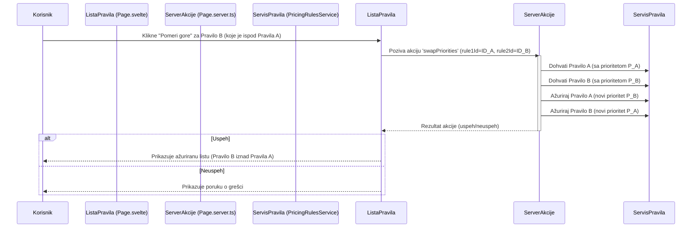

# Plan za Implementaciju Promene Redosleda Prioriteta Pravila Cena

Ovaj dokument opisuje plan za implementaciju funkcionalnosti promene redosleda prioriteta za pravila cena korišćenjem "Pomeri gore" / "Pomeri dole" strelica.

## 1. Kontekst i Cilj

Korisnici trenutno mogu da definišu numerički prioritet za svako pravilo cena prilikom njegove izmene. Cilj je omogućiti intuitivniju promenu redosleda pravila direktno na listi pravila, bez potrebe za ručnim unosom brojeva prioriteta za svako pravilo pojedinačno.

## 2. Predloženo Rešenje: Strelice "Pomeri gore" / "Pomeri dole"

Implementiraćemo dugmiće sa strelicama pored svakog pravila na listi, koji će omogućiti korisniku da pomera pravila gore ili dole, čime se efektivno menja njihov prioritet.

## 3. Detaljan Plan Implementacije

### 3.1. Backend Izmene (`src/routes/(app)/crm/pricing-rules/+page.server.ts`)

Postojeća metoda `list()` u `PricingRulesService` već vraća pravila sortirana po prioritetu (`.order('priority', { ascending: true })`), što je dobra osnova.

*   **Nova serverska akcija: `swapPriorities`**
    *   **Ulazni parametri:** `rule1Id` (ID pravila koje je "više" na listi ili će biti nakon zamene) i `rule2Id` (ID pravila koje je "niže" na listi ili će biti nakon zamene).
    *   **Logika:**
        1.  Dohvatiti oba pravila (`rule1` i `rule2`) koristeći `PricingRulesService.getById()`.
        2.  Ako oba pravila postoje:
            *   Sačuvati originalne vrednosti prioriteta: `priorityRule1 = rule1.priority` i `priorityRule2 = rule2.priority`.
            *   Ažurirati `rule1` sa prioritetom od `rule2`: `await pricingRulesService.update(rule1Id, { priority: priorityRule2 })`.
            *   Ažurirati `rule2` sa prioritetom od `rule1`: `await pricingRulesService.update(rule2Id, { priority: priorityRule1 })`.
            *   Vratiti uspešan odgovor.
        3.  Ako neko od pravila ne postoji ili dođe do greške tokom ažuriranja, vratiti odgovarajuću grešku.
    *   **Primer poziva forme (za pomeranje pravila `currentRule` naniže, ispod `nextRule`):**
        *   `rule1Id` će biti `currentRule.id`.
        *   `rule2Id` će biti `nextRule.id`.
        *   Nakon zamene, `currentRule` će imati prioritet od `nextRule`, a `nextRule` će imati prioritet od `currentRule`.

### 3.2. Frontend Izmene (`src/routes/(app)/crm/pricing-rules/+page.svelte`)

*   **Dodavanje kolone ili izmena postojeće za akcije pomeranja:**
    *   Iterirati kroz `data.rules` koristeći `{#each data.rules as rule, index}`.
    *   **Dugme "Pomeri gore":**
        *   Koristiti Lucide Svelte ikonu (npr. `<ArrowUpCircle class="h-4 w-4" />`).
        *   Vidljivo/omogućeno ako `index > 0`.
        *   Implementirati kao `<form method="POST" action="?/swapPriorities" use:enhance>`.
        *   Skrivena polja u formi:
            *   `<input type="hidden" name="rule1Id" value={data.rules[index - 1].id} />` (pravilo iznad)
            *   `<input type="hidden" name="rule2Id" value={rule.id} />` (trenutno pravilo)
        *   Stilizovati kao `Button` sa `variant="ghost"` ili slično.
    *   **Dugme "Pomeri dole":**
        *   Koristiti Lucide Svelte ikonu (npr. `<ArrowDownCircle class="h-4 w-4" />`).
        *   Vidljivo/omogućeno ako `index < data.rules.length - 1`.
        *   Implementirati kao `<form method="POST" action="?/swapPriorities" use:enhance>`.
        *   Skrivena polja u formi:
            *   `<input type="hidden" name="rule1Id" value={rule.id} />` (trenutno pravilo)
            *   `<input type="hidden" name="rule2Id" value={data.rules[index + 1].id} />` (pravilo ispod)
        *   Stilizovati kao `Button` sa `variant="ghost"` ili slično.
*   **Korisničko iskustvo:**
    *   Koristiti `enhance` iz `$app/forms` za progresivno poboljšanje formi, omogućavajući ažuriranje bez potpunog osvežavanja stranice.
    *   Nakon uspešne `swapPriorities` akcije, SvelteKit-ov mehanizam za invalidaciju podataka (npr. implicitno kroz promenu na serveru ili eksplicitno sa `invalidateAll`) će osvežiti `data.rules`, što će dovesti do ponovnog iscrtavanja tabele sa novim redosledom.
    *   Prikazati `toast` notifikacije za uspeh ili neuspeh operacije.

### 3.3. Dijagram Sekvence (Pojednostavljen)

## 4. Potencijalna Razmatranja

*   **Konkurentnost:** U scenarijima sa više korisnika koji istovremeno menjaju prioritete, može doći do konflikata. Trenutni plan ne uključuje mehanizme za zaključavanje, ali zamena vrednosti prioriteta bi trebalo da bude relativno atomična po paru.
*   **Performanse:** Za veoma duge liste, performanse bi mogle postati problem, ali sa trenutnim pristupom (ažuriranje dva reda po akciji), ne očekuju se veći problemi.
*   **Korisnički Interfejs:** Potrebno je pažljivo integrisati nove dugmiće u postojeći dizajn tabele kako bi interfejs ostao čist i pregledan. Razmotriti da li ih staviti direktno u red ili unutar postojećeg "Akcije" dropdown menija.

## 5. Sledeći Koraci

1.  Potvrditi ovaj plan.
2.  Preći u "Code" mod za implementaciju opisanih izmena.