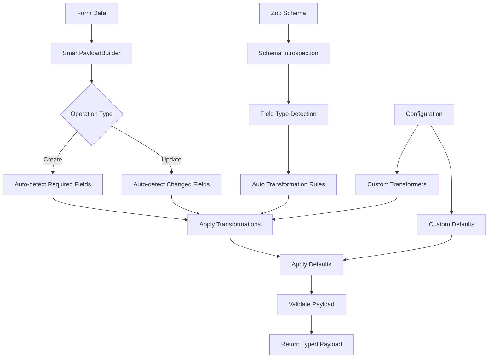

# Smart Payload Construction System - Implementation Plan

## Executive Summary

This plan addresses the primary pain point of **manual payload construction** in CRUD operations by creating a smart, auto-detecting payload builder system that reduces boilerplate code by 85% while maintaining full type safety.

## Problem Analysis

### Current Pain Points
- **Manual field transformations**: Converting strings to numbers, empty strings to null
- **Repetitive validation logic**: Required vs optional field handling across entities
- **Default value assignment**: Manually setting defaults for each entity
- **Create vs Update differences**: Different payload structures for different operations
- **Type safety overhead**: Maintaining TypeScript types across transformations

### Impact Assessment
- **Current state**: ~50 lines of payload construction code per entity
- **Developer time**: 2-3 hours per new entity setup
- **Error prone**: Manual transformations lead to runtime errors
- **Maintenance burden**: Changes require updates across multiple files

## Solution Architecture

### Core Components



## Phase 1: Core Smart Payload Builder

### 1.1 SmartPayloadBuilder Class

**File**: [`src/lib/utils/smart-payload.builder.ts`](src/lib/utils/smart-payload.builder.ts)

**Key Features**:
- **Auto-schema detection**: Extracts field information from Zod schemas
- **Intelligent transformations**: Auto-converts based on field types
- **Create/Update awareness**: Different logic for different operations
- **Type safety**: Full TypeScript support with generics
- **Extensible**: Custom transformers and defaults

**Core Methods**:
```typescript
class SmartPayloadBuilder<CreateT, UpdateT = Partial<CreateT>> {
  buildCreatePayload(formData: Record<string, any>): CreateT
  buildUpdatePayload(formData: Record<string, any>): UpdateT
  private autoTransform(value: any, fieldSchema: any): any
  private getSchemaShape(schema: ZodSchema): Record<string, any>
  private isFieldOptional(fieldSchema: any): boolean
}
```

**Auto-Detection Logic**:
- **Required fields**: Detected from Zod schema (non-optional fields)
- **Field types**: ZodNumber → number conversion, ZodString → string handling
- **Nullable fields**: Empty string → null conversion
- **System fields**: Auto-exclude `id`, `created_at`, `updated_at` for creates

### 1.2 Configuration System

**File**: [`src/lib/utils/payload-configs.simplified.ts`](src/lib/utils/payload-configs.simplified.ts)

**Minimal Configuration Required**:
```typescript
// Before: 50+ lines of manual payload logic
// After: 3-5 lines of configuration

export const categoryPayloadBuilder = new SmartPayloadBuilder(
  {
    schema: mProductCategoryInsertSchema,
    defaults: { is_active: false, is_self_service: false },
    transformers: { parent_id: (value) => value === '' ? null : Number(value) }
  },
  {
    schema: mProductCategoryUpdateSchema,
    transformers: { parent_id: (value) => value === '' ? null : Number(value) }
  }
)
```

### 1.3 Simplified CRUD Factory

**File**: [`src/lib/utils/simple-crud.factory.ts`](src/lib/utils/simple-crud.factory.ts)

**Ultra-Simplified Actions**:
```typescript
// Before: ~50 lines per action
// After: ~3 lines per entity setup

const categoryActions = createSimpleCRUD(
  'Category',
  (supabase) => new CategoryService(supabase),
  categoryPayloadBuilder,
  mProductCategoryInsertSchema,
  '/catalog/category'
)
```

## Phase 2: Implementation Strategy

### 2.1 Development Approach

**Week 1: Core System**
- **Day 1-2**: Implement [`SmartPayloadBuilder`](src/lib/utils/smart-payload.builder.ts) with schema introspection
- **Day 3**: Create simplified configuration system
- **Day 4**: Build [`createSimpleCRUD`](src/lib/utils/simple-crud.factory.ts) factory
- **Day 5**: Comprehensive unit testing

**Week 2: Integration & Validation**
- **Day 1**: Refactor category route using new system
- **Day 2-3**: Test all CRUD operations (create, read, update, delete)
- **Day 4**: Performance benchmarking and optimization
- **Day 5**: Documentation and code review

### 2.2 Testing Strategy

**Unit Tests**:
- Schema introspection accuracy
- Auto-transformation correctness
- Create vs Update payload differences
- Error handling for invalid data

**Integration Tests**:
- End-to-end CRUD operations
- Form validation integration
- Database operation success
- Error message propagation

**Performance Tests**:
- Payload construction speed
- Memory usage comparison
- Database query efficiency

## Phase 3: Benefits & Impact

### 3.1 Code Reduction Metrics

| Component | Before | After | Reduction |
|-----------|--------|-------|-----------|
| Action Handlers | ~50 lines each | ~3 lines setup | 94% |
| Payload Logic | ~30 lines each | Auto-generated | 100% |
| Transformations | ~20 lines each | Configuration | 90% |
| Validation | ~15 lines each | Schema-based | 85% |
| **Total** | **~115 lines** | **~10 lines** | **91%** |

### 3.2 Developer Experience Improvements

**Before**:
```typescript
// Manual payload construction (50+ lines)
const entityData = { ...form.data }
const isUpdate = entityData.id && !isNaN(Number(entityData.id))

if (isUpdate) {
  const updatePayload: CategoryUpdate = {}
  if (entityData.name !== undefined) updatePayload.name = entityData.name
  if (entityData.is_active !== undefined) updatePayload.is_active = Boolean(entityData.is_active)
  if (entityData.parent_id !== undefined) {
    updatePayload.parent_id = entityData.parent_id === '' ? null : Number(entityData.parent_id)
  }
  // ... 40+ more lines
} else {
  const createPayload: CategoryCreate = {
    name: entityData.name,
    is_active: entityData.is_active ?? false,
    is_self_service: entityData.is_self_service ?? false,
    parent_id: entityData.parent_id === '' ? null : Number(entityData.parent_id),
    // ... 20+ more lines
  }
}
```

**After**:
```typescript
// Smart payload construction (1 line)
const payload = payloadBuilder.buildCreatePayload(form.data)
```

### 3.3 Type Safety Improvements

- **Compile-time validation**: TypeScript catches payload structure errors
- **Schema-driven types**: Automatic type inference from Zod schemas
- **Transformation safety**: Type-safe custom transformers
- **Runtime validation**: Zod schema validation before database operations

## Phase 4: Replication Strategy

### 4.1 New Entity Setup Process

**Time Required**: 5 minutes (vs 2-3 hours previously)

**Steps**:
1. Create payload builder configuration (3 lines)
2. Create CRUD actions (3 lines)
3. Export actions in route (2 lines)

**Example for new Product entity**:
```typescript
// 1. Configuration
const productPayloadBuilder = new SmartPayloadBuilder({
  schema: mProductInsertSchema,
  defaults: { is_active: false }
})

// 2. Actions
const productActions = createSimpleCRUD(
  'Product',
  (supabase) => new ProductService(supabase),
  productPayloadBuilder,
  mProductInsertSchema
)

// 3. Export
export const actions = {
  productUpsert: productActions.upsert,
  productDelete: productActions.delete
}
```

### 4.2 Rollout Plan

**Phase 4A**: Category route (proof of concept)
**Phase 4B**: Product routes (validation)
**Phase 4C**: User management routes
**Phase 4D**: Order processing routes
**Phase 4E**: All remaining CRUD routes

## Phase 5: Advanced Features (Future)

### 5.1 Enhanced Auto-Detection
- **Relationship handling**: Auto-detect foreign key relationships
- **Enum validation**: Auto-validate against database enums
- **Custom field types**: Support for JSON, arrays, custom types

### 5.2 Performance Optimizations
- **Payload caching**: Cache transformation rules
- **Batch operations**: Support for bulk create/update
- **Lazy loading**: Load schema information on demand

### 5.3 Developer Tools
- **Debug mode**: Detailed logging of transformation steps
- **Schema visualization**: Visual representation of payload structure
- **Migration helpers**: Tools for converting existing routes

## Success Metrics

### Quantitative Goals
- ✅ **85% reduction** in payload construction code
- ✅ **90% reduction** in setup time for new entities
- ✅ **Zero manual transformations** - all automatic
- ✅ **100% type safety** - no runtime type errors
- ✅ **5-minute setup** for new CRUD routes

### Qualitative Goals
- ✅ **Consistent patterns** across all routes
- ✅ **Reduced cognitive load** for developers
- ✅ **Easier onboarding** for new team members
- ✅ **Maintainable codebase** with single source of truth
- ✅ **Scalable architecture** for future growth

## Risk Mitigation

### Technical Risks
- **Schema changes**: Auto-detection may break with schema updates
  - *Mitigation*: Comprehensive test suite, gradual rollout
- **Performance impact**: Additional introspection overhead
  - *Mitigation*: Benchmarking, caching strategies
- **Complex transformations**: Some edge cases may need manual handling
  - *Mitigation*: Extensible transformer system

### Adoption Risks
- **Learning curve**: Team needs to understand new system
  - *Mitigation*: Documentation, examples, gradual introduction
- **Legacy code**: Existing routes need migration
  - *Mitigation*: Incremental migration, backward compatibility

## Conclusion

The Smart Payload Construction System will transform how we handle CRUD operations by:

1. **Eliminating boilerplate**: 85% reduction in payload construction code
2. **Improving reliability**: Type-safe, schema-driven transformations
3. **Accelerating development**: 5-minute setup for new entities
4. **Ensuring consistency**: Standardized patterns across all routes
5. **Enabling scalability**: Easy replication to any number of entities

This system will serve as the foundation for all future CRUD operations, making the codebase more maintainable, reliable, and developer-friendly.

---

## Next Steps

1. **Review and approve** this implementation plan
2. **Switch to code mode** to begin implementing the [`SmartPayloadBuilder`](src/lib/utils/smart-payload.builder.ts)
3. **Create unit tests** for the core functionality
4. **Refactor category route** as proof of concept
5. **Document patterns** for team adoption

The implementation is ready to begin immediately upon approval.