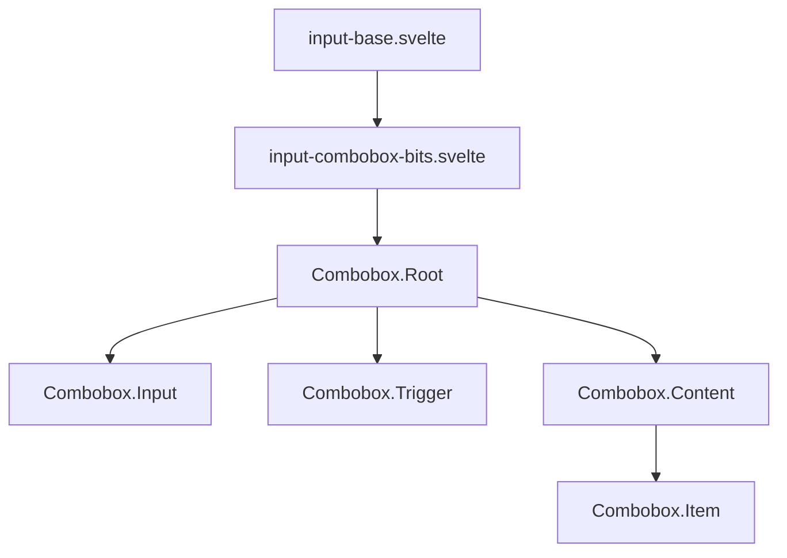

# Bits-UI Combobox Implementation Plan

## Overview

This plan outlines the approach for creating a new combobox component using bits-ui to replace the current Zag-based implementation. The new component will maintain the same API and styling pattern while leveraging bits-ui's functionality.

## Requirements

- **Single-select mode only** (matching current implementation)
- **Maintain id/label interface** for items (instead of bits-ui's default value/label)
- **Preserve all current functionality** visible in the test page
- **Use Svelte 5 snippets** for integration with BaseInput
- **Maintain styling consistency** with other input components

## Component Architecture



## Implementation Strategy

The main challenge is adapting bits-ui's value/label pattern to work with our id/label interface. We'll handle this by mapping between them in the component.

## Detailed Implementation

```svelte
<script lang="ts">
    import type { HTMLInputAttributes } from 'svelte/elements';
    import { Combobox } from "bits-ui";
    import { cn } from '$lib/utils';
    import PhList from '~icons/ph/list';
    import PhCaretDown from '~icons/ph/caret-down';  
    import BaseInput from './input-base.svelte';
    
    type ComboboxItem = {
        id: string | number;
        label: string;
        [key: string]: any; // Allow additional properties
    };
    
    type Props = HTMLInputAttributes & {
        ref?: HTMLInputElement | null;
        items: ComboboxItem[]; // Array of items to select from
        value?: string | number | null; // ID of the selected item
        placeholder?: string;
        disabled?: boolean;
        error?: string;
        labelText?: string;
        inline?: boolean;
        class?: string;
    };
    
    let {
        ref = $bindable(null),
        items = [],
        value = $bindable(null), // This will be the ID
        placeholder = 'Select an option',
        disabled = false,
        error,
        labelText,
        inline = false,
        class: className = '',
        ...restProps
    }: Props = $props();
    
    // Internal state
    let searchValue = $state("");
    let open = $state(false);
    
    // Map our id/label items to value/label format expected by bits-ui
    const bitsItems = $derived(items.map(item => ({
        value: String(item.id), // Bits-UI expects string values
        label: item.label
    })));
    
    // Filtering logic - filter items based on search input
    const filteredItems = $derived(
        searchValue === ""
            ? bitsItems
            : bitsItems.filter(item => 
                item.label.toLowerCase().includes(searchValue.toLowerCase())
            )
    );

    // Handle value changes - convert between our ID format and bits-ui's string values
    $effect(() => {
        if (value !== null && value !== undefined) {
            // We have a value, ensure it's of type string for bits-ui
            comboboxValue = String(value);
        } else {
            comboboxValue = undefined;
        }
    });
    
    // Internal value for bits-ui (as string)
    let comboboxValue = $state<string | undefined>(value !== null ? String(value) : undefined);
    
    // Handle when bits-ui updates the value
    $effect(() => {
        if (comboboxValue !== undefined) {
            // Convert back to number or string based on original type
            if (items.find(item => typeof item.id === 'number')) {
                value = Number(comboboxValue);
            } else {
                value = comboboxValue;
            }
        } else {
            value = null;
        }
    });
    
    // Define snippets for BaseInput
    let Icon = $snippet(() => {
        return <PhList class="text-muted-foreground" />;
    });
    
    let Content = $snippet(() => {
        return (
            <Combobox.Input
                ref={ref}
                placeholder={placeholder}
                disabled={disabled}
                class={cn(
                    'peer flex h-full w-full items-center border-none pl-2',
                    'text-primary-foreground outline-none'
                )}
                {...restProps}
                oninput={(e) => (searchValue = e.currentTarget.value)}
            />
        );
    });
    
    let Action = $snippet(() => {
        return (
            <div class="ml-auto flex h-full items-center gap-1 text-muted-foreground">
                <Combobox.Trigger 
                    class="flex h-full items-center justify-center rounded-sm hover:text-primary-foreground"
                    aria-label="Toggle options"
                >
                    <PhCaretDown />
                </Combobox.Trigger>
            </div>
        );
    });
</script>

<div class="relative">
    <Combobox.Root 
        type="single"
        bind:value={comboboxValue}
        bind:open={open}
        onOpenChange={(isOpen) => {
            if (!isOpen) searchValue = "";
        }}
    >
        <BaseInput 
            class={className}
            {error}
            {labelText}
            {inline}
            Icon={Icon}
            Content={Content}
            Action={Action}
        />

        <Combobox.Portal>
            <Combobox.Content
                class={cn(
                    'focus-override border-muted bg-background shadow-popover data-[state=open]:animate-in data-[state=closed]:animate-out data-[state=closed]:fade-out-0 data-[state=open]:fade-in-0 data-[state=closed]:zoom-out-95 data-[state=open]:zoom-in-95 data-[side=bottom]:slide-in-from-top-2 data-[side=left]:slide-in-from-right-2 data-[side=right]:slide-in-from-left-2 data-[side=top]:slide-in-from-bottom-2 outline-hidden z-50 max-h-60 w-[var(--bits-combobox-anchor-width)] min-w-[var(--bits-combobox-anchor-width)] select-none rounded-md border px-1 py-2 overflow-auto',
                    inline
                        ? 'top-0 right-0 left-[calc(120px+0.75rem)]'
                        : 'top-[calc(100%+4px)] right-0 left-0'
                )}
                sideOffset={4}
            >
                <Combobox.Viewport>
                    {#each filteredItems as item (item.value)}
                        <Combobox.Item
                            value={item.value}
                            label={item.label}
                            class="flex cursor-default select-none items-center rounded-sm px-2 py-1.5 text-sm outline-none data-[highlighted]:bg-accent data-[highlighted]:text-accent-foreground data-[selected]:bg-primary data-[selected]:text-primary-foreground"
                        >
                            {#snippet children({ selected })}
                                {item.label}
                                {#if selected}
                                    <div class="ml-auto">
                                        <svg 
                                            width="15" 
                                            height="15" 
                                            viewBox="0 0 15 15" 
                                            fill="none" 
                                            xmlns="http://www.w3.org/2000/svg"
                                            class="h-4 w-4"
                                        >
                                            <path 
                                                d="M11.4669 3.72684C11.7558 3.91574 11.8369 4.30308 11.648 4.59198L7.39799 11.092C7.29783 11.2452 7.13556 11.3467 6.95402 11.3699C6.77247 11.3931 6.58989 11.3355 6.45446 11.2124L3.70446 8.71241C3.44905 8.48022 3.43023 8.08494 3.66242 7.82953C3.89461 7.57412 4.28989 7.55529 4.5453 7.78749L6.75292 9.79441L10.6018 3.90792C10.7907 3.61902 11.178 3.53795 11.4669 3.72684Z" 
                                                fill="currentColor" 
                                                fill-rule="evenodd" 
                                                clip-rule="evenodd"
                                            />
                                        </svg>
                                    </div>
                                {/if}
                            {/snippet}
                        </Combobox.Item>
                    {:else}
                        <div class="px-2 py-4 text-center text-sm text-muted-foreground">
                            No results found
                        </div>
                    {/each}
                </Combobox.Viewport>
            </Combobox.Content>
        </Combobox.Portal>
    </Combobox.Root>
</div>
```

## Key Integration Points

1. **Value Type Conversion**: Bits-UI expects string values, but our component uses IDs that might be numbers. We handle this conversion in both directions with effects.

2. **Search and Filtering**: Implemented with a state variable for search input and a derived state for filtered items.

3. **BaseInput Integration**: Using three snippets (Icon, Content, Action) to provide content to the BaseInput component.

4. **Styling**: Maintaining consistent styling with other components by using the same Tailwind classes.

5. **Dropdown Positioning**: Supporting both inline and standard layout modes by adjusting positioning classes.

## Testing Approach

Testing will use the existing test page (`src/routes/(app)/test/input-components/+page.svelte`), which already includes tests for the combobox component:

- Test selection behavior
- Test filtering functionality
- Test keyboard navigation
- Test inline styling mode

## Migration Path

1. Create new component as `input-combobox-bits.svelte`
2. Test thoroughly using the existing test page
3. Update the index.ts file to export the new component instead of the old one
4. Optionally remove the old implementation if no longer needed

## Advantages over Current Implementation

1. **Better Accessibility**: bits-ui components have strong accessibility support
2. **More Consistent Behavior**: Better cross-browser compatibility
3. **Modern Implementation**: Uses newer Svelte 5 patterns
4. **Improved Performance**: bits-ui is optimized for performance