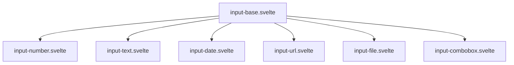

# Detailed Implementation Plan: MyComboboxInput Component with Zag Integration

## Overview

This plan outlines the approach for creating a new `input-combobox.svelte` component that integrates the Zag combobox functionality within the existing input component architecture. The component will follow the same patterns as the other specialized input components, using the base input component with Svelte 5 snippets.

## Component Integration



## Implementation Details

### Component Structure

The new `input-combobox.svelte` component will:

1. Use the `input-base.svelte` component for consistent UI structure
2. Leverage Zag's combobox state machine for dropdown functionality
3. Follow the styling patterns established by other input components
4. Support common input properties and add combobox-specific ones

### File Structure

```
src/lib/components/my/input/
├── input-base.svelte       # Base component (existing)
├── input-combobox.svelte   # New combobox component
└── index.ts                # Updated to export the new component
```

### Code Implementation

#### 1. Component Definition

```svelte
<script lang="ts">
	import type { HTMLInputAttributes } from 'svelte/elements';
	import * as combobox from '@zag-js/combobox';
	import { useMachine, normalizeProps } from '@zag-js/svelte';
	import { cn } from '$lib/utils';
	import PhList from '~icons/ph/list'; // Or another appropriate icon
	import BaseInput from './input-base.svelte';
	
	type ComboboxItem = {
		id: string | number;
		label: string;
		[key: string]: any; // Allow additional properties
	};
	
	type Props = HTMLInputAttributes & {
		ref?: HTMLInputElement | null;
		items: ComboboxItem[]; // Array of items to select from
		value?: ComboboxItem | null; // Currently selected item
		placeholder?: string;
		disabled?: boolean;
		error?: string;
		labelText?: string;
		inline?: boolean;
		class?: string;
	};
	
	let {
		ref = $bindable(null),
		items = [],
		value = $bindable(null),
		placeholder = "Select an option",
		disabled = false,
		error,
		labelText,
		inline = false,
		class: className = '',
		...restProps
	}: Props = $props();
	
	// Internal state
	let options = $state(items);
	let inputValue = $state('');
	
	// Item handlers - fixed as per requirements
	const itemToString = (item: ComboboxItem) => item.label;
	const itemToValue = (item: ComboboxItem) => item.id.toString();
	
	// Create collection
	const collection = $derived(() => {
		return combobox.collection({
			items,
			itemToString,
			itemToValue
		});
	});
	
	// Generate a unique ID for the combobox
	const comboboxId = restProps.id || `combobox-${Math.random().toString(36).slice(2, 11)}`;
	
	// Create machine
	const machine = useMachine(combobox.machine, {
		id: comboboxId,
		collection,
		onOpenChange() {
			options = items;
		},
		onInputValueChange({ inputValue: newInputValue }) {
			inputValue = newInputValue;
			
			const filtered = items.filter((item) =>
				itemToString(item).toLowerCase().includes(newInputValue.toLowerCase())
			);
			options = filtered.length > 0 ? filtered : items;
		},
		onValueChange({ selectedItem }) {
			if (selectedItem) {
				value = selectedItem;
			}
		}
	});
	
	const api = $derived(combobox.connect(machine, normalizeProps));
	
	// Update input value when value changes
	$effect(() => {
		if (value) {
			inputValue = itemToString(value);
		} else {
			inputValue = '';
		}
	});
</script>
```

#### 2. Snippets for Base Input Component

```svelte
{#snippet comboboxIcon()}
	<PhList class="text-muted-foreground" />
{/snippet}

{#snippet comboboxContent()}
	<div class="w-full">
		<input
			bind:this={ref}
			{...api.getInputProps()}
			placeholder={placeholder}
			disabled={disabled}
			class={cn(
				'peer flex h-full w-full items-center border-none pl-2',
				'text-primary-foreground outline-none'
			)}
			{...restProps}
		/>
	</div>
{/snippet}

{#snippet comboboxActions()}
	<div class="ml-auto flex h-full items-center gap-1 text-muted-foreground">
		<button
			type="button"
			{...api.getTriggerProps()}
			class="flex h-full items-center justify-center rounded-sm hover:text-primary-foreground"
			aria-label="Toggle options"
		>
			▼
		</button>
	</div>
{/snippet}
```

#### 3. Component Template

```svelte
<BaseInput
	bind:ref
	class={className}
	{error}
	{labelText}
	{inline}
	Icon={comboboxIcon}
	Content={comboboxContent}
	Action={comboboxActions}
/>

<!-- Dropdown section - positioned below the BaseInput component -->
<div {...api.getPositionerProps()} class="relative z-50">
	{#if api.isOpen && options.length > 0}
		<div
			{...api.getContentProps()}
			class="max-h-60 w-full overflow-auto rounded-md border border-input bg-popover text-popover-foreground shadow-md"
		>
			<ul class="py-1">
				{#each options as item}
					<li
						{...api.getItemProps({ item })}
						class="relative flex cursor-default select-none items-center rounded-sm px-2 py-1.5 text-sm outline-none data-[highlighted]:bg-accent data-[highlighted]:text-accent-foreground"
					>
						{itemToString(item)}
					</li>
				{/each}
			</ul>
		</div>
	{/if}
</div>
```

#### 4. Update index.ts

The `index.ts` file will need to be updated to include the new component:

```typescript
// import MyCurrencyInput from './currency-input.svelte';
import CurrencyInput from './input-currency.svelte';
import DateInput from './input-date.svelte';
import FileInput from './input-file.svelte';
import NumberInput from './input-number.svelte';
import TextInput from './input-text.svelte';
import UrlInput from './input-url.svelte';
import ComboboxInput from './input-combobox.svelte';

export {
	CurrencyInput as MyCurrencyInput,
	DateInput as MyDateInput,
	FileInput as MyFileInput,
	NumberInput as MyNumberInput,
	TextInput as MyTextInput,
	ComboboxInput as MyCombobox,
	UrlInput as MyUrlInput
};
```

## Key Functional Aspects

### 1. State Management

- Uses Zag's state machine for managing combobox state
- Tracks selected item, input value, and dropdown open state
- Properly syncs with Svelte 5's bindable state

### 2. Dropdown Positioning

- Positions the dropdown beneath the input 
- Uses Zag's positioning system to ensure proper placement
- Maintains z-index to appear above other content

### 3. Selection and Filtering

- Filters items as the user types
- Updates the selected value when an item is clicked
- Synchronizes the value with the parent component

### 4. Accessibility

- Leverages Zag's built-in accessibility features
- Keyboard navigation support
- Proper ARIA attributes for screen readers

### 5. Styling Consistency

- Uses the same styling patterns as other input components
- Consistent with the application's design system
- Dropdown styling that matches the application theme

## Usage Example

```svelte
<script>
	import { MyCombobox } from '$lib/components/my/input';
	
	const countries = [
		{ id: 'us', label: 'United States' },
		{ id: 'ca', label: 'Canada' },
		{ id: 'uk', label: 'United Kingdom' },
		{ id: 'au', label: 'Australia' },
		{ id: 'de', label: 'Germany' },
		{ id: 'fr', label: 'France' },
	];
	
	let selectedCountry = $state(null);
</script>

<MyCombobox
	items={countries}
	bind:value={selectedCountry}
	placeholder="Select a country"
	labelText="Country"
/>
```

## Implementation Steps

1. Create the new `input-combobox.svelte` file with the structure outlined above.

2. Implement the snippets for the icon, content, and action areas.

3. Add the dropdown positioning and item rendering.

4. Update the `index.ts` file to export the new component.

5. Test the component with various use cases:
   - Selection of items
   - Keyboard navigation
   - Filtering capabilities
   - Form integration
   - Mobile responsiveness

## Differences from combobox-zag.svelte

The new implementation differs from the original `combobox-zag.svelte` in the following ways:

1. **Integration with Base Input**: Uses the established input component architecture with `input-base.svelte`

2. **Styling Consistency**: Follows the styling pattern of other input components

3. **Enhanced Props**: Adds support for common input properties like error states, labels, etc.

4. **Fixed Item Handling**: Uses fixed `itemToString` and `itemToValue` functions as specified

5. **Better Value Synchronization**: Improves the sync between the selected item and the input value

## Next Steps After Implementation

After creating this component, we should:

1. Thoroughly test with different datasets and scenarios
2. Update the component demo page to showcase the combobox functionality
3. Consider future enhancements like multi-select capability