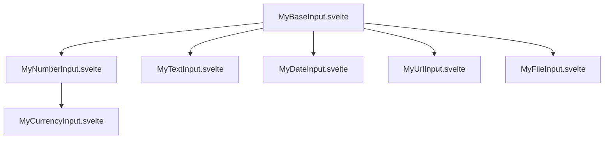

# Detailed Implementation Plan: Separating Input Components with Svelte 5 Snippets

## Overview

This plan outlines the approach for separating the current `MyInput.svelte` component into specialized components using Svelte 5's snippet mechanism rather than slots. This will provide specialized handling for each input type, with particular attention to solving the number locale issues.

## Component Architecture



## 1. Base Component: MyBaseInput.svelte

This component will provide the common structure and styling but use Svelte 5 snippets for customization:

```svelte
<script lang="ts">
    import type { HTMLInputAttributes } from 'svelte/elements';
    import { cn } from '$lib/utils.js';

    type Props = HTMLInputAttributes & {
        ref?: HTMLInputElement | null;
        class?: string;
        label?: string;
        error?: string;
    };

    let {
        ref = $bindable(null),
        class: className = '',
        label,
        error,
        ...restProps
    }: Props = $props();
    
    // Define default snippets that can be overridden
    let Icon = $snippet() => {
        // Default empty snippet
    };
    
    let Action = $snippet() => {
        // Default empty snippet
    };
    
    let inputField = $snippet() => {
        return (
            <input
                bind:this={ref}
                class={cn('peer flex h-full w-full items-center border-none pl-2 text-primary-foreground outline-none')}
                {...restProps}
            />
        );
    };
</script>

<div class={cn(
    'flex h-10 w-full items-center rounded-sm border border-solid border-input bg-background px-2 focus-within:border-primary',
    className
)}>
    <div class="leading-icon">
        {@render Icon()}
    </div>
    
    <div class="input-container flex-grow">
        {@render inputField()}
    </div>
    
    <div class="action-buttons">
        {@render Action()}
    </div>
</div>

{#if error}
    <div class="text-sm text-destructive mt-1">{error}</div>
{/if}
```

## 2. Number Input Component: MyNumberInput.svelte

This specialized component will focus on proper number handling with locale support:

```svelte
<script lang="ts">
    import type { HTMLInputAttributes } from 'svelte/elements';
    import { cn } from '$lib/utils.js';
    import MyBaseInput from './MyBaseInput.svelte';
    import PhNumpad from '~icons/ph/numpad';
    import PhPlus from '~icons/ph/plus';
    import PhMinus from '~icons/ph/minus';
    
    type Props = HTMLInputAttributes & {
        ref?: HTMLInputElement | null;
        value?: number | null | string;
        locale?: string;
        min?: number;
        max?: number;
        step?: number;
        precision?: number; // Number of decimal places
        readonly?: boolean;
    };
    
    let {
        ref = $bindable(null),
        value = $bindable(null), // Allow null/undefined, handle internally
        locale = 'sr-Latn-RS', // Default locale Serbian Latin
        min = Number.MIN_SAFE_INTEGER,
        max = Number.MAX_SAFE_INTEGER,
        step = 1,
        precision = 2,
        readonly = false,
        ...restProps
    }: Props = $props();
    
    // Internal state
    let internalValue = $state<number | null>(null); // Actual number value
    let displayValue = $state('');     // Formatted string for display
    let isFocused = $state(false);
    
    // Get locale-specific format data
    let formatData = $derived(() => {
        // Get decimal and thousand separators using Intl.NumberFormat
        const formatter = new Intl.NumberFormat(locale);
        const parts = formatter.formatToParts(12345.6);
        
        let decimalSep = '.';
        let thousandSep = ',';
        let currency = '';
        
        for (const part of parts) {
            if (part.type === 'decimal') {
                decimalSep = part.value;
            } else if (part.type === 'group') {
                thousandSep = part.value;
            } else if (part.type === 'currency') {
                currency = part.value;
            }
        }
        
        return { decimalSep, thousandSep, currency };
    });
    
    // Create a formatter based on the locale and precision
    let formatter = $derived(() => {
        return new Intl.NumberFormat(locale, {
            maximumFractionDigits: precision,
            minimumFractionDigits: 0,
            useGrouping: true
        });
    });
    
    // Function to parse a locale-specific number string into a number
    function parseLocaleNumber(text: string): number | null {
        if (!text || text.trim() === '') return null;
        
        const trimmedText = text.trim();
        console.log(`MyNumberInput: Parsing "${trimmedText}" with locale "${locale}"`);
        
        try {
            // Step 1: Remove thousand separators
            const { decimalSep, thousandSep } = formatData;
            const escThousandSep = thousandSep.replace(/[.*+?^${}()|[\]\\]/g, '\\$&');
            let processedText = trimmedText;
            
            if (escThousandSep) {
                const thousandRegex = new RegExp(escThousandSep, 'g');
                processedText = processedText.replace(thousandRegex, '');
            }
            
            // Step 2: Replace decimal separator with standard period
            if (decimalSep !== '.') {
                // Ensure there's only one decimal separator
                const escDecimalSep = decimalSep.replace(/[.*+?^${}()|[\]\\]/g, '\\$&');
                const decimalCount = (processedText.match(new RegExp(escDecimalSep, 'g')) || []).length;
                
                if (decimalCount > 1) {
                    console.error(`MyNumberInput: Multiple decimal separators in "${processedText}"`);
                    return null;
                }
                
                processedText = processedText.replace(decimalSep, '.');
            }
            
            // Step 3: Validate and parse
            const validNumberRegex = /^-?\d*\.?\d*$/;
            
            if (!validNumberRegex.test(processedText)) {
                console.warn(`MyNumberInput: Invalid number format: "${processedText}"`);
                return null;
            }
            
            const num = Number(processedText);
            return isNaN(num) ? null : num;
        } catch (error) {
            console.error(`MyNumberInput: Error parsing number:`, error);
            
            // Fallback for common cases - directly try comma to dot replacement
            if (/^-?\d+,\d+$/.test(trimmedText)) {
                const withDot = trimmedText.replace(',', '.');
                return Number(withDot);
            }
            
            return null;
        }
    }
    
    // Function to format a number for display according to locale
    function formatLocaleNumber(num: number | null): string {
        if (num === null || isNaN(num)) return '';
        try {
            return formatter.format(num);
        } catch (e) {
            console.error(`MyNumberInput: Error formatting number:`, e);
            return String(num);
        }
    }
    
    // Effect to sync value prop with internal state
    $effect(() => {
        // Handle various value inputs (number, string, null)
        let parsedValue: number | null = null;
        
        if (value === null || value === undefined || value === '') {
            parsedValue = null;
        } else if (typeof value === 'number') {
            parsedValue = isNaN(value) ? null : value;
        } else if (typeof value === 'string') {
            parsedValue = parseLocaleNumber(value);
        }
        
        // Only update if different to avoid loops
        if (internalValue !== parsedValue) {
            internalValue = parsedValue;
            
            // Update display value if not focused
            if (!isFocused) {
                displayValue = formatLocaleNumber(internalValue);
            }
        }
    });
    
    // Handle input blur - parse and update value
    function handleBlur() {
        isFocused = false;
        
        // Parse the display value
        const parsed = parseLocaleNumber(displayValue);
        
        // Apply min/max constraints
        let constrainedValue = parsed;
        if (parsed !== null) {
            if (parsed < min) constrainedValue = min;
            if (parsed > max) constrainedValue = max;
        }
        
        // Update internal value
        internalValue = constrainedValue;
        
        // Update external value
        value = constrainedValue;
        
        // Format display value
        displayValue = formatLocaleNumber(internalValue);
    }
    
    function handleFocus() {
        isFocused = true;
    }
    
    // Increment/decrement value
    function updateValue(increment: boolean) {
        if (readonly) return;
        
        const currentVal = internalValue ?? 0;
        const validStep = typeof step === 'number' && !isNaN(step) ? step : 1;
        
        let newValue = currentVal + (increment ? validStep : -validStep);
        
        // Apply constraints
        if (newValue < min) newValue = min;
        if (newValue > max) newValue = max;
        
        // Round to precision if needed
        if (precision > 0) {
            const factor = Math.pow(10, precision);
            newValue = Math.round(newValue * factor) / factor;
        }
        
        internalValue = newValue;
        displayValue = formatLocaleNumber(newValue);
        value = newValue;
    }
    
    // Define snippets for the base component
    let Icon = $snippet() => {
        return <PhNumpad class="text-muted-foreground" />;
    };
    
    let inputField = $snippet() => {
        return (
            <input
                bind:this={ref}
                bind:value={displayValue}
                type="text"
                inputmode="decimal"
                onblur={handleBlur}
                onfocus={handleFocus}
                readonly={readonly}
                class={cn(
                    'peer flex h-full w-full [appearance:textfield] items-center border-none pl-2',
                    'text-primary-foreground outline-none',
                    '[&::-webkit-inner-spin-button]:appearance-none [&::-webkit-outer-spin-button]:appearance-none'
                )}
                aria-label={restProps['aria-label'] || 'Numeric input'}
                {...restProps}
            />
        );
    };
    
    let Action = $snippet() => {
        return (
            <div class="-mx-2 ml-auto flex h-full items-center text-muted-foreground">
                {#if !readonly}
                    <button
                        type="button"
                        onclick={() => updateValue(false)}
                        class="flex h-full items-center justify-center rounded-sm hover:text-primary-foreground"
                        aria-label="Decrement"
                    >
                        <PhMinus />
                    </button>
                    <button
                        type="button"
                        onclick={() => updateValue(true)}
                        class="flex aspect-square h-full w-full items-center justify-center rounded-sm hover:text-primary-foreground"
                        aria-label="Increment"
                    >
                        <PhPlus />
                    </button>
                {/if}
            </div>
        );
    };
</script>

<MyBaseInput 
    ref={ref}
    {...restProps}
>
    {@render Icon()}
    {@render inputField()}
    {@render Action()}
</MyBaseInput>
```

## 3. Additional Specialized Components

### MyTextInput.svelte

```svelte
<script lang="ts">
    import { cn } from '$lib/utils.js';
    import MyBaseInput from './MyBaseInput.svelte';
    import PhTextAa from '~icons/ph/text-aa';
    
    type Props = HTMLInputAttributes & {
        ref?: HTMLInputElement | null;
        value?: string;
    };
    
    let {
        ref = $bindable(null),
        value = $bindable(''),
        ...restProps
    }: Props = $props();
    
    // Define snippets
    let Icon = $snippet() => {
        return <PhTextAa class="text-base text-muted-foreground" />;
    };
    
    let inputField = $snippet() => {
        return (
            <input
                bind:this={ref}
                bind:value={value}
                type="text"
                class={cn(
                    'peer flex h-full w-full items-center border-none pl-2',
                    'text-primary-foreground outline-none'
                )}
                {...restProps}
            />
        );
    };
</script>

<MyBaseInput
    ref={ref}
    {...restProps}
>
    {@render Icon()}
    {@render inputField()}
</MyBaseInput>
```

### MyDateInput.svelte

```svelte
<script lang="ts">
    import { DateTime } from 'luxon';
    import { cn } from '$lib/utils.js';
    import MyBaseInput from './MyBaseInput.svelte';
    import PhCalendar from '~icons/ph/calendar';
    
    type Props = HTMLInputAttributes & {
        ref?: HTMLInputElement | null;
        value?: Date | string | null;
        locale?: string;
        format?: string; // Date format string
    };
    
    let {
        ref = $bindable(null),
        value = $bindable(null),
        locale = 'sr-Latn-RS',
        format = 'dd.MM.yyyy', // Default format for Serbian locale
        ...restProps
    }: Props = $props();
    
    // Internal state
    let internalDate = $state<DateTime | null>(null);
    let displayValue = $state('');
    let isFocused = $state(false);
    
    // Parse various date inputs to DateTime
    function parseDate(input: Date | string | null): DateTime | null {
        if (input === null || input === undefined || input === '') return null;
        
        if (input instanceof Date) {
            return DateTime.fromJSDate(input).setLocale(locale);
        }
        
        if (typeof input === 'string') {
            // Try parsing with the specified format
            let dt = DateTime.fromFormat(input, format, { locale });
            
            // If that fails, try some other common formats
            if (!dt.isValid) {
                dt = DateTime.fromISO(input).setLocale(locale);
            }
            
            if (!dt.isValid) {
                dt = DateTime.fromHTTP(input).setLocale(locale);
            }
            
            return dt.isValid ? dt : null;
        }
        
        return null;
    }
    
    // Format DateTime to string for display
    function formatDate(dt: DateTime | null): string {
        if (!dt || !dt.isValid) return '';
        return dt.toFormat(format);
    }
    
    // Effect to sync value prop with internal state
    $effect(() => {
        const parsedDate = parseDate(value);
        
        if (
            (internalDate === null && parsedDate === null) ||
            (internalDate?.equals(parsedDate) ?? false)
        ) {
            return; // No change needed
        }
        
        internalDate = parsedDate;
        
        // Update display if not focused
        if (!isFocused) {
            displayValue = formatDate(internalDate);
        }
    });
    
    function handleBlur() {
        isFocused = false;
        
        // Try to parse the display value
        const inputDate = DateTime.fromFormat(displayValue, format, { locale });
        
        if (inputDate.isValid) {
            internalDate = inputDate;
            // Update the external value - convert to appropriate type
            if (typeof value === 'string') {
                value = inputDate.toFormat(format);
            } else {
                value = inputDate.toJSDate();
            }
        }
        
        // Re-format display
        displayValue = formatDate(internalDate);
    }
    
    function handleFocus() {
        isFocused = true;
    }
    
    // Define snippets
    let Icon = $snippet() => {
        return <PhCalendar class="text-muted-foreground" />;
    };
    
    let inputField = $snippet() => {
        return (
            <input
                bind:this={ref}
                bind:value={displayValue}
                type="text"
                onblur={handleBlur}
                onfocus={handleFocus}
                placeholder={format.toLowerCase()}
                class={cn(
                    'peer flex h-full w-full items-center border-none pl-2',
                    'text-primary-foreground outline-none'
                )}
                {...restProps}
            />
        );
    };
</script>

<MyBaseInput
    ref={ref}
    {...restProps}
>
    {@render Icon()}
    {@render inputField()}
</MyBaseInput>
```

### MyUrlInput.svelte 

```svelte
<script lang="ts">
    import { cn } from '$lib/utils.js';
    import MyBaseInput from './MyBaseInput.svelte';
    import PhArrowSquareUpLeft from '~icons/ph/arrow-square-up-left';
    import PhCursorClick from '~icons/ph/cursor-click';
    
    type Props = HTMLInputAttributes & {
        ref?: HTMLInputElement | null;
        value?: string;
    };
    
    let {
        ref = $bindable(null),
        value = $bindable(''),
        ...restProps
    }: Props = $props();
    
    // URL validation function
    function isValidUrl(url: string): boolean {
        if (!url || url.trim() === '') return false;
        
        try {
            new URL(url);
            return true;
        } catch {
            // Try adding https:// if missing protocol
            if (!/^https?:\/\//i.test(url)) {
                try {
                    new URL(`https://${url}`);
                    return true;
                } catch {
                    return false;
                }
            }
            return false;
        }
    }
    
    // Get proper URL for href
    function getFormattedUrl(url: string): string {
        if (!url || url.trim() === '') return '';
        
        // Add https if it doesn't have a protocol
        if (!/^https?:\/\//i.test(url)) {
            return `https://${url}`;
        }
        
        return url;
    }
    
    // Define snippets
    let Icon = $snippet() => {
        return <PhArrowSquareUpLeft class="text-muted-foreground" />;
    };
    
    let inputField = $snippet() => {
        return (
            <input
                bind:this={ref}
                bind:value={value}
                type="url"
                class={cn(
                    'peer flex h-full w-full items-center border-none pl-2',
                    'text-primary-foreground outline-none'
                )}
                {...restProps}
            />
        );
    };
    
    let Action = $snippet() => {
        return (
            <div class="-mx-2 ml-auto flex h-full items-center text-muted-foreground hover:text-primary-foreground">
                {#if value && isValidUrl(value)}
                    <a
                        href={getFormattedUrl(value)}
                        target="_blank"
                        class="flex aspect-square h-full items-center justify-center rounded-sm"
                        aria-label="Visit URL"
                    >
                        <PhCursorClick />
                    </a>
                {/if}
            </div>
        );
    };
</script>

<MyBaseInput
    ref={ref}
    {...restProps}
>
    {@render Icon()}
    {@render inputField()}
    {@render Action()}
</MyBaseInput>
```

### MyFileInput.svelte

```svelte
<script lang="ts">
    import { cn } from '$lib/utils.js';
    import MyBaseInput from './MyBaseInput.svelte';
    import PhFile from '~icons/ph/file';
    
    type Props = HTMLInputAttributes & {
        ref?: HTMLInputElement | null;
    };
    
    let {
        ref = $bindable(null),
        ...restProps
    }: Props = $props();
    
    let fileName = $state('');
    
    function handleFileChange(event: Event) {
        const target = event.target as HTMLInputElement;
        if (target.files && target.files.length > 0) {
            fileName = target.files[0].name;
        } else {
            fileName = '';
        }
    }
    
    // Define snippets
    let Icon = $snippet() => {
        return <PhFile class="text-muted-foreground" />;
    };
    
    let inputField = $snippet() => {
        return (
            <div class="relative w-full">
                <input
                    bind:this={ref}
                    type="file"
                    class="absolute inset-0 w-full h-full opacity-0 cursor-pointer"
                    onchange={handleFileChange}
                    {...restProps}
                />
                <div class="peer flex h-full w-full items-center border-none pl-2 text-primary-foreground overflow-hidden text-ellipsis whitespace-nowrap">
                    {fileName || 'Select file...'}
                </div>
            </div>
        );
    };
</script>

<MyBaseInput
    ref={ref}
    {...restProps}
>
    {@render Icon()}
    {@render inputField()}
</MyBaseInput>
```

## 4. Implementation Steps

### Step 1: Create the Base Component

Create `MyBaseInput.svelte` with the structure outlined above, supporting Svelte 5 snippets for customization.

### Step 2: Create MyNumberInput

Implement `MyNumberInput.svelte` with the robust locale-aware number handling.

### Step 3: Create Other Specialized Components

Implement the other input types.

### Step 4: Update Usage

Update all places that currently use the MyInput component. For example:

```svelte
<!-- Before -->
<MyInput type="number" bind:value={price} locale="sr-Latn-RS" />

<!-- After -->
<MyNumberInput bind:value={price} locale="sr-Latn-RS" />
```

## Specific Solution for Number Locale Issue

The key improvements in the `MyNumberInput` component that solve your locale issues:

1. **Robust Parsing Logic**:
   - Properly extracts decimal and thousand separators using Intl.NumberFormat
   - Handles removal of thousand separators first
   - Correctly replaces locale-specific decimal separator with standard period
   - Includes multiple validation and fallback mechanisms

2. **Value Handling**:
   - Stores the actual number value internally, not a string
   - Updates the external value with a number, not a string
   - This ensures that "2,45" in Serbian is correctly stored as `2.45` (number)

3. **Formatting For Display**:
   - Consistently uses the locale-aware formatter when displaying

4. **Clear Separation of Concerns**:
   - Input/output parsing separated from display formatting
   - Validation, constraints, and updating handled in discrete functions

## Testing Approach

To ensure the solution works correctly:

1. **Unit Tests**:
   - Test parsing with various locales and input formats
   - Test edge cases like null values, invalid inputs
   - Test rounding/precision handling

2. **Manual Testing**:
   - Test with Serbian locale input "2,45" to ensure it's stored as 2.45
   - Test increment/decrement behavior
   - Test min/max constraints

## Migration Strategy

1. **Incremental Approach**:
   - Create all components first
   - Update usages one by one, starting with the most critical ones
   - Run tests after each update

2. **Parallel Development**:
   - Keep the existing MyInput.svelte until migration is complete
   - This allows for gradual migration without breaking existing functionality