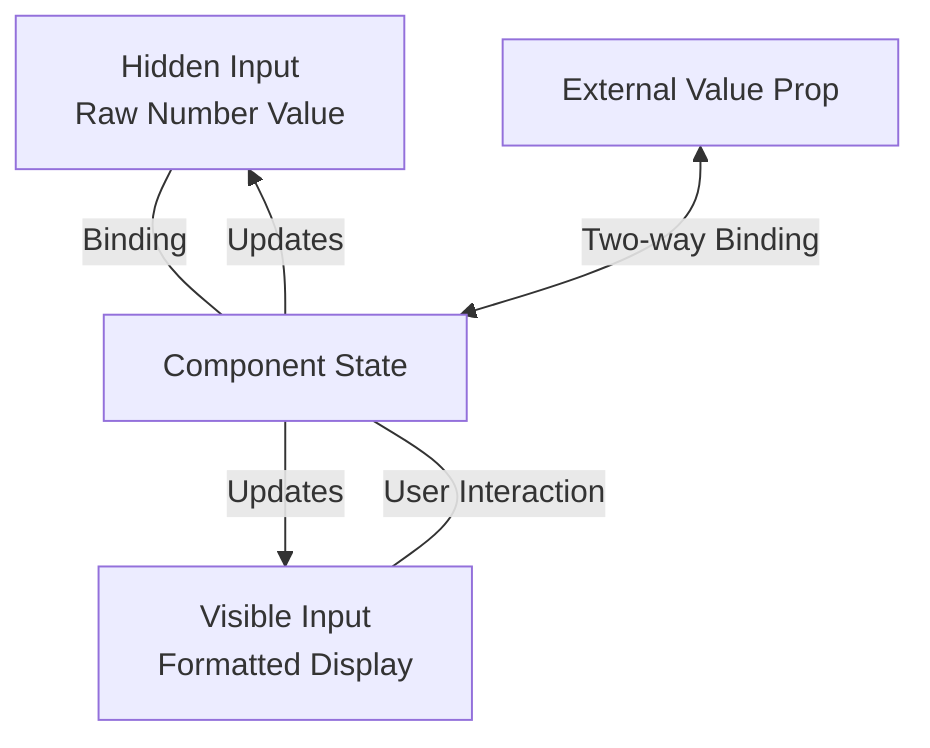

# Implementation Plan: Two-Input Approach for MyNumberInput

## Overview

This document outlines a detailed plan for converting the current `MyNumberInput.svelte` component to use a two-input approach for better handling of locale-specific number formatting.

## Current Implementation Analysis

The current implementation:
- Uses a single input with internal state management
- Maintains both `internalValue` (number) and `displayValue` (string)
- Handles parsing/formatting on focus/blur events
- Works, but has potential edge cases with cursor positioning and editing

## Proposed Two-Input Approach



### Core Benefits

1. **Clean Separation of Concerns**
   - Hidden input: Deals with raw numeric value (e.g., `2.45`)
   - Visible input: Handles formatted display value (e.g., `2,45` in Serbian)

2. **Improved Form Handling**
   - Form submissions receive the proper numeric value
   - Form validation works with the actual value

3. **Enhanced User Experience**
   - User always sees properly formatted values
   - No formatting jumps during editing
   - Cursor position maintained during editing

## Implementation Details

### State Management

```typescript
// Internal state
let rawValue = $state<number | null>(null);  // For data binding and hidden input
let displayValue = $state('');               // For user display and visible input
let isFocused = $state(false);               // Track focus state
```

### Input References

```typescript
// References to input elements
let hiddenInputRef = $state<HTMLInputElement | null>(null);
let visibleInputRef = $state<HTMLInputElement | null>(null);

// Connect external ref to visible input
$effect(() => {
  ref = visibleInputRef;
});
```

### Props Handling

```typescript
// Extract form-specific attributes for hidden input
const formProps = {
  name: restProps.name,
  form: restProps.form,
  required: restProps.required
};

// Remove form props from visible input props
const visibleInputProps = { ...restProps };
delete visibleInputProps.name;
delete visibleInputProps.form;
delete visibleInputProps.required;
```

### Synchronization Logic

```typescript
// Sync external value to internal state
$effect(() => {
  // Parse incoming value
  let parsedValue = parseLocaleNumber(value);
  
  // Update internal state if different
  if (rawValue !== parsedValue) {
    rawValue = parsedValue;
    
    // Update display if not focused
    if (!isFocused) {
      displayValue = formatLocaleNumber(rawValue);
    }
    
    // Update hidden input
    updateHiddenInput();
  }
});

// Handle blur: parse display value and update everything
function handleBlur() {
  isFocused = false;
  
  // Parse display value, apply constraints
  const parsed = parseLocaleNumber(displayValue);
  const constrained = applyConstraints(parsed);
  
  // Update all values
  rawValue = constrained;
  value = constrained;
  displayValue = formatLocaleNumber(constrained);
  updateHiddenInput();
}
```

### HTML Structure

```html
<!-- Container div remains the same as current implementation -->
<div class="...">
  <!-- Leading icon remains the same -->
  <div class="leading-icon">...</div>
  
  <div class="input-container flex-grow">
    <!-- Hidden input for raw numeric value -->
    <input
      bind:this={hiddenInputRef}
      type="hidden"
      value={rawValue === null ? '' : String(rawValue)}
      aria-hidden="true"
      {...formProps}
    />
    
    <!-- Visible input for user interaction -->
    <input
      bind:this={visibleInputRef}
      bind:value={displayValue}
      type="text"
      inputmode="decimal"
      onblur={handleBlur}
      onfocus={handleFocus}
      {...visibleInputProps}
    />
  </div>
  
  <!-- Action buttons remain the same -->
  <div class="action-buttons">...</div>
</div>
```

## Complete Implementation Code

```svelte
<script lang="ts">
  import type { HTMLInputAttributes } from 'svelte/elements';
  import { cn } from '$lib/utils.js';
  import PhNumpad from '~icons/ph/numpad';
  import PhPlus from '~icons/ph/plus';
  import PhMinus from '~icons/ph/minus';

  type Props = HTMLInputAttributes & {
    ref?: HTMLInputElement | null;
    value?: number | null | string;
    locale?: string;
    min?: number;
    max?: number;
    step?: number;
    precision?: number;
    readonly?: boolean;
    class?: string;
    error?: string;
    type?: string; // Allow type to be passed, but handled specially
  };

  let {
    ref = $bindable(null),
    value = $bindable(null),
    locale = 'sr-Latn-RS', // Default locale Serbian Latin
    min = Number.MIN_SAFE_INTEGER,
    max = Number.MAX_SAFE_INTEGER,
    step = 1,
    precision = 2,
    readonly = false,
    class: className,
    error,
    type, // Acknowledge but handle specially
    ...restProps
  }: Props = $props();

  // Extract form-specific attributes for the hidden input
  const formProps = {
    name: restProps.name,
    form: restProps.form,
    required: restProps.required
  };
  
  // Create props for visible input without form properties
  const visibleInputProps = { ...restProps };
  delete visibleInputProps.name;
  delete visibleInputProps.form;
  delete visibleInputProps.required;

  // References to the input elements
  let hiddenInputRef = $state<HTMLInputElement | null>(null);
  let visibleInputRef = $state<HTMLInputElement | null>(null);

  // Connect to ref prop
  $effect(() => {
    ref = visibleInputRef;
  });

  // Internal state
  let rawValue = $state<number | null>(null); // Raw numeric value
  let displayValue = $state(''); // Formatted display value
  let isFocused = $state(false);

  // Get locale-specific format data
  let formatData = $derived(() => {
    // Get decimal and thousand separators using Intl.NumberFormat
    const formatter = new Intl.NumberFormat(locale);
    // @ts-ignore - Using internal API that might not be in TypeScript definitions
    const parts = formatter.formatToParts(12345.6);

    let decimalSep = '.';
    let thousandSep = ',';
    let currency = '';

    for (const part of parts) {
      if (part.type === 'decimal') {
        decimalSep = part.value;
      } else if (part.type === 'group') {
        thousandSep = part.value;
      } else if (part.type === 'currency') {
        currency = part.value;
      }
    }

    return { decimalSep, thousandSep, currency };
  });

  // Create a formatter based on the locale and precision
  let formatter = $derived(() => {
    return new Intl.NumberFormat(locale, {
      maximumFractionDigits: precision,
      minimumFractionDigits: 0,
      useGrouping: true
    });
  });

  // Function to parse a locale-specific number string into a number
  function parseLocaleNumber(text: any): number | null {
    // Handle non-string inputs
    if (text === null || text === undefined) return null;

    // Convert to string if it's not already
    const textStr = String(text);
    if (textStr.trim() === '') return null;

    const trimmedText = textStr.trim();
    console.log(`MyNumberInput: Parsing "${trimmedText}" with locale "${locale}"`);

    try {
      // Step 1: Remove thousand separators
      const formatInfo = formatData();
      const decimalSep = formatInfo.decimalSep;
      const thousandSep = formatInfo.thousandSep;
      const escThousandSep = thousandSep.replace(/[.*+?^${}()|[\]\\]/g, '\\$&');
      let processedText = trimmedText;

      if (escThousandSep) {
        const thousandRegex = new RegExp(escThousandSep, 'g');
        processedText = processedText.replace(thousandRegex, '');
      }

      // Step 2: Replace decimal separator with standard period
      if (decimalSep !== '.') {
        // Ensure there's only one decimal separator
        const escDecimalSep = decimalSep.replace(/[.*+?^${}()|[\]\\]/g, '\\$&');
        const decimalCount = (processedText.match(new RegExp(escDecimalSep, 'g')) || []).length;

        if (decimalCount > 1) {
          console.error(`MyNumberInput: Multiple decimal separators in "${processedText}"`);
          return null;
        }

        processedText = processedText.replace(decimalSep, '.');
      }

      // Step 3: Validate and parse
      const validNumberRegex = /^-?\d*\.?\d*$/;

      if (!validNumberRegex.test(processedText)) {
        console.warn(`MyNumberInput: Invalid number format: "${processedText}"`);

        // Try a more lenient approach for common cases
        const num = parseFloat(processedText);
        return isNaN(num) ? null : num;
      }

      const num = parseFloat(processedText);
      console.log(`MyNumberInput: Successfully parsed number: ${num}`);
      return isNaN(num) ? null : num;
    } catch (error) {
      console.error(`MyNumberInput: Error parsing number:`, error);

      // Fallback approach for common cases
      // If we see a pattern that looks like a number with a comma decimal separator
      if (/^-?\d+,\d+$/.test(trimmedText)) {
        const withDot = trimmedText.replace(',', '.');
        const num = parseFloat(withDot);
        console.log(`MyNumberInput: Fallback parsed with comma as decimal: ${num}`);
        return isNaN(num) ? null : num;
      }

      return null;
    }
  }

  // Function to format a number for display according to locale
  function formatLocaleNumber(num: number | null): string {
    if (num === null || isNaN(num)) return '';
    try {
      return formatter().format(num);
    } catch (e) {
      console.error(`MyNumberInput: Error formatting number:`, e);
      return String(num);
    }
  }

  // Update hidden input value
  function updateHiddenInput() {
    if (hiddenInputRef) {
      hiddenInputRef.value = rawValue === null ? '' : String(rawValue);
    }
  }

  // Sync external value with internal state
  $effect(() => {
    // Handle various value inputs (number, string, null)
    let parsedValue: number | null = null;

    if (value === null || value === undefined || value === '') {
      parsedValue = null;
    } else if (typeof value === 'number') {
      parsedValue = isNaN(value) ? null : value;
    } else {
      // Handle any other type by parsing it
      parsedValue = parseLocaleNumber(value);
    }

    // Ensure parsedValue is a number or null
    if (parsedValue !== null) {
      parsedValue = Number(parsedValue);
    }

    // Only update if different to avoid loops
    if (rawValue !== parsedValue) {
      rawValue = parsedValue;

      // Update display value if not focused
      if (!isFocused) {
        displayValue = formatLocaleNumber(rawValue);
      }
      
      // Update hidden input value
      updateHiddenInput();
    }
  });

  // Handle visible input blur
  function handleBlur() {
    isFocused = false;

    // Parse the display value
    const parsed = parseLocaleNumber(displayValue);

    // Apply min/max constraints
    let constrainedValue = parsed;
    if (parsed !== null) {
      if (parsed < min) constrainedValue = min;
      if (parsed > max) constrainedValue = max;
    }

    // Update raw value
    rawValue = constrainedValue;
    
    // Update hidden input
    updateHiddenInput();

    // Update external value - ensure it's a number or null
    value = constrainedValue === null ? null : Number(constrainedValue);

    // Format display value
    displayValue = formatLocaleNumber(rawValue);
  }

  function handleFocus() {
    isFocused = true;
  }

  // Handle form resets
  function handleFormReset() {
    rawValue = null;
    displayValue = '';
    value = null;
    updateHiddenInput();
  }

  // Increment/decrement value
  function updateValue(increment: boolean) {
    if (readonly) return;

    const currentVal = rawValue ?? 0;
    const validStep = typeof step === 'number' && !isNaN(step) ? step : 1;

    let newValue = currentVal + (increment ? validStep : -validStep);

    // Apply constraints
    if (newValue < min) newValue = min;
    if (newValue > max) newValue = max;

    // Round to precision if needed
    if (precision > 0) {
      const factor = Math.pow(10, precision);
      newValue = Math.round(newValue * factor) / factor;
    }

    // Update all values consistently
    rawValue = newValue;
    displayValue = formatLocaleNumber(newValue);
    value = Number(newValue);
    updateHiddenInput();
  }
</script>

<div
  class={cn(
    'flex h-10 w-full items-center rounded-sm border border-solid border-input bg-background px-2 focus-within:border-primary',
    className
  )}
>
  <div class="leading-icon">
    <PhNumpad class="text-muted-foreground" />
  </div>

  <div class="input-container flex-grow">
    <!-- Hidden input for raw value storage and form submission -->
    <input
      bind:this={hiddenInputRef}
      type="hidden"
      value={rawValue === null ? '' : String(rawValue)}
      aria-hidden="true"
      {...formProps}
    />

    <!-- Visible input for user interaction -->
    <input
      bind:this={visibleInputRef}
      bind:value={displayValue}
      type="text"
      inputmode="decimal"
      onblur={handleBlur}
      onfocus={handleFocus}
      onreset={handleFormReset}
      {readonly}
      class={cn(
        'peer flex h-full w-full [appearance:textfield] items-center border-none pl-2',
        'text-primary-foreground outline-none',
        '[&::-webkit-inner-spin-button]:appearance-none [&::-webkit-outer-spin-button]:appearance-none'
      )}
      aria-label={visibleInputProps['aria-label'] || 'Numeric input'}
      {...visibleInputProps}
    />
  </div>

  <div class="action-buttons">
    {#if !readonly}
      <div class="-mx-2 ml-auto flex h-full items-center text-muted-foreground">
        <button
          type="button"
          onclick={() => updateValue(false)}
          class="flex h-full items-center justify-center rounded-sm hover:text-primary-foreground"
          aria-label="Decrement"
        >
          <PhMinus />
        </button>
        <button
          type="button"
          onclick={() => updateValue(true)}
          class="flex aspect-square h-full w-full items-center justify-center rounded-sm hover:text-primary-foreground"
          aria-label="Increment"
        >
          <PhPlus />
        </button>
      </div>
    {/if}
  </div>
</div>

{#if error}
  <div class="mt-1 text-destructive">{error}</div>
{/if}
```

## Key Differences from Current Implementation

1. **Two Inputs Instead of One**
   - Hidden input for raw numeric value
   - Visible input for formatted display

2. **Attribute Handling**
   - Form attributes (`name`, `form`, `required`) applied to hidden input
   - All other attributes applied to visible input 

3. **Value Flow**
   - External `value` ↔ `rawValue` (internal) ↔ Hidden Input
   - `rawValue` → `displayValue` (when not focused) ← Visible Input

4. **Reference Handling**
   - Component's `ref` prop connected to visible input
   - Both inputs tracked with internal references

## Implementation Steps

1. **Back up** the current implementation
2. **Replace** with the new implementation
3. **Test thoroughly** with:
   - Various locales (especially Serbian with comma decimal separator)
   - Form submission
   - Validation
   - Increment/decrement
   - Min/max constraints

## Advantages of Two-Input Approach

1. **Clearer Separation of Concerns**
   - Data binding uses standard number format
   - Display formatting follows locale conventions

2. **Better Form Integration**
   - Forms receive correctly typed numeric values
   - Form validation works properly

3. **Improved User Experience**
   - Users always see properly formatted values
   - No format changes during editing
   - Better handling of cursor position

4. **Maintainability**
   - State management is simplified
   - Easier to reason about the component's behavior

## Testing Considerations

- Test with Serbian locale: input "2,45" should store 2.45
- Test increment/decrement with various precision settings
- Verify form submission contains numeric values
- Check validity state propagation
- Test with various browsers and screen readers