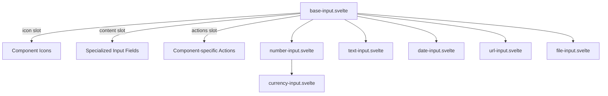

# Input Component Refactoring Plan

## Current Situation

After examining the codebase, I've found:

1. There's a well-defined plan in `my-input-locale-plan.md` to create a component hierarchy with `MyBaseInput.svelte` as the foundation
2. The `base-input.svelte` component exists and uses Svelte 5 snippets (`{#snippet}` syntax)
3. Specialized input components (`text-input.svelte`, `number-input.svelte`, etc.) exist but don't utilize `base-input.svelte`
4. Each specialized component duplicates the container structure and styling code
5. The `index.ts` exports all components with "My" prefixes

## Issues Identified

The main issue is that we're not leveraging the shared code from `base-input.svelte`. Each component is duplicating:

1. Container structure and styling
2. Error message handling
3. Basic layout with icon + input + actions pattern

## Proposed Solution

We should refactor each specialized input component to use `base-input.svelte` as its foundation, utilizing the snippet slots for customization.

### Component Architecture



### Common Structure

Each specialized component will follow this pattern:

```svelte
<script>
    import BaseInput from './base-input.svelte';
    // Component-specific imports and logic
</script>

<BaseInput ref={ref} class={className} error={error} {...restProps}>
    {#snippet icon()}
        <!-- Component-specific icon -->
    {/snippet}
    
    {#snippet content()}
        <!-- Component-specific input fields -->
    {/snippet}
    
    {#snippet actions()}
        <!-- Component-specific action buttons (if any) -->
    {/snippet}
</BaseInput>
```

## Implementation Plan for Each Component

### 1. TextInput (Simplest Component)

```svelte
<script>
    import BaseInput from './base-input.svelte';
    import { cn } from '$lib/utils.js';
    import PhTextAa from '~icons/ph/text-aa';
    
    // Type definitions and props handling remain the same
    // ...
</script>

<BaseInput ref={ref} class={className} error={error} {...restProps}>
    {#snippet icon()}
        <PhTextAa class="text-base text-muted-foreground" />
    {/snippet}
    
    {#snippet content()}
        <input
            bind:this={ref}
            bind:value
            type="text"
            class={cn(
                'peer flex h-full w-full items-center border-none pl-2',
                'text-primary-foreground outline-none'
            )}
            {...restProps}
        />
    {/snippet}
</BaseInput>
```

### 2. NumberInput

```svelte
<script>
    import BaseInput from './base-input.svelte';
    // All other imports and specialized logic remain the same
    // ...
</script>

<BaseInput ref={ref} class={className} error={error} {...restProps}>
    {#snippet icon()}
        <PhNumpad class="text-muted-foreground" />
    {/snippet}
    
    {#snippet content()}
        <!-- Hidden input for form submission -->
        <input
            bind:this={hiddenInputRef}
            type="hidden"
            value={rawValue === null ? '' : String(rawValue)}
            aria-hidden="true"
            {...formProps}
        />
        
        <!-- Visible input for user interaction -->
        <input
            bind:this={visibleInputRef}
            bind:value={displayValue}
            type="text"
            inputmode="decimal"
            onblur={handleBlur}
            onfocus={handleFocus}
            onreset={handleFormReset}
            {readonly}
            class={cn(
                'peer flex h-full w-full [appearance:textfield] items-center border-none pl-2',
                'text-primary-foreground outline-none',
                '[&::-webkit-inner-spin-button]:appearance-none [&::-webkit-outer-spin-button]:appearance-none'
            )}
            aria-label={visibleInputProps['aria-label'] || 'Numeric input'}
            {...visibleInputProps}
        />
    {/snippet}
    
    {#snippet actions()}
        {#if !readonly}
            <div class="ml-auto flex h-full items-center gap-0.5 text-muted-foreground">
                <button
                    type="button"
                    onclick={() => updateValue(false)}
                    class="flex h-full items-center justify-center rounded-sm hover:text-primary-foreground"
                    aria-label="Decrement"
                >
                    <PhMinus />
                </button>
                <button
                    type="button"
                    onclick={() => updateValue(true)}
                    class="flex aspect-square h-full w-full items-center justify-center rounded-sm hover:text-primary-foreground"
                    aria-label="Increment"
                >
                    <PhPlus />
                </button>
            </div>
        {/if}
    {/snippet}
</BaseInput>
```

### 3. DateInput, UrlInput, FileInput

Similar patterns would be applied to the other input components, preserving their specialized logic while moving their container structure to the base component.

## Testing Strategy

1. Refactor one component at a time, starting with the simplest (TextInput)
2. Test each component after refactoring to ensure it:
   - Renders correctly with appropriate styling
   - Maintains all specialized behaviors
   - Correctly passes props to the base component
3. Run comprehensive tests with different inputs and edge cases

## Benefits of This Approach

1. **Reduced Duplication**: Container structure, styling, and error handling code is shared
2. **Consistent UI**: All inputs will have consistent styling and behavior
3. **Easier Maintenance**: Changes to common elements only need to be made in base-input
4. **Specialized Logic Preserved**: Each component maintains its specific behavior

## Implementation Steps

1. Verify the base-input.svelte component correctly handles all required props and has appropriate snippet slots
2. Refactor each specialized input component in this order:
   - TextInput (simplest)
   - NumberInput
   - DateInput
   - UrlInput
   - FileInput
   - CurrencyInput (if it extends NumberInput)
3. Update any imports or usage patterns as needed
4. Conduct comprehensive testing